# Hyper-Vanguard (SvmDebug) 系统设计文档

> **项目名称**: Hyper-Vanguard / SvmDebug  
> **作者**: yewilliam  
> **版本**: v2.0  
> **日期**: 2026/03/21  
> **总代码量**: ~24,000 行 (37+ 源文件)

---

## 目录

1. [项目概述](#1-项目概述)
2. [系统总体架构](#2-系统总体架构)
3. [权限层级模型](#3-权限层级模型)
4. [模块依赖关系](#4-模块依赖关系)
5. [R3 用户态层](#5-r3-用户态层)
6. [R0 内核驱动层](#6-r0-内核驱动层)
7. [VMM Host 层 — SVM 引擎](#7-vmm-host-层--svm-引擎)
8. [NPT 嵌套页表管理](#8-npt-嵌套页表管理)
9. [NPT Hook 框架](#9-npt-hook-框架)
10. [进程保护系统 (Hide)](#10-进程保护系统-hide)
11. [深度内核拦截 (DeepHook)](#11-深度内核拦截-deephook)
12. [影子调试系统 (DebugApi)](#12-影子调试系统-debugapi)
13. [Hypervisor 内存操作 (HvMemory)](#13-hypervisor-内存操作-hvmemory)
14. [进程伪装系统 (Disguise)](#14-进程伪装系统-disguise)
15. [CE dbk64 桥接层](#15-ce-dbk64-桥接层)
16. [日志系统 (SvmLog)](#16-日志系统-svmlog)
17. [核心数据结构详解](#17-核心数据结构详解)
18. [IOCTL 通信协议](#18-ioctl-通信协议)
19. [CPUID 超级调用协议](#19-cpuid-超级调用协议)
20. [HOOK_INDEX 枚举完整定义](#20-hook_index-枚举完整定义)
21. [启动与初始化流程](#21-启动与初始化流程)
22. [卸载与清理流程](#22-卸载与清理流程)
23. [文件清单与职责](#23-文件清单与职责)

---

## 1. 项目概述

### 1.1 项目定位

Hyper-Vanguard 是一个基于 **AMD SVM (Secure Virtual Machine)** 硬件虚拟化技术的内核级进程保护与透明调试框架。系统在操作系统下方建立一个 Type-1 Hypervisor，利用 **嵌套页表 (NPT)** 实现硬件级无痕函数 Hook，对运行在 Guest 中的反作弊系统 完全透明。

### 1.2 核心能力矩阵

| 能力维度 | 实现技术 | 对反作弊系统的效果 |
|---------|---------|--------------|
| **进程隐藏** | NPT Hook 30+ Nt/Ps/Ob 系统调用 + Win32k SSSDT | 反作弊系统枚举进程列表/句柄列表时看不到保护进程 |
| **句柄权限控制** | Hook ObReferenceObjectByHandleWithTag 裁剪 GrantedAccess | 反作弊系统获得的句柄被降权，同时可升权指定PID绕过 |
| **透明调试** | 自定义 DEBUG_OBJECT + 影子 DebugPort + NPT隐形断点 | 反作弊系统读取 EPROCESS.DebugPort 永远为 NULL |
| **隐形内存操作** | CPUID 超级调用 → VMM 物理页表遍历 → PA 直接拷贝 | 不触发任何内核 API，反作弊系统的回调完全无感知 |
| **进程伪装** | DKOM 修改 PEB/LDR/ImageFileName → explorer.exe | 反作弊系统查询进程身份信息时返回系统进程特征 |
| **深度内核防御** | 特征码扫描 + NPT Hook 18个未导出内核函数 | 封堵 APC 注入、物理内存扫描、CID 表查询 |

### 1.3 技术要求

| 项目 | 要求 | 检测方法 |
|------|------|---------|
| CPU | AMD 处理器，支持 SVM | `CPUID Fn8000_0001_ECX[SVM]` bit2 = 1 |
| NPT | 需要 RVI/NPT 支持 | `CPUID Fn8000_000A_EDX[NP]` bit0 = 1 |
| BIOS | SVM/Virtualization 已启用 | `VM_CR.SVMDIS` (MSR 0xC0010114) bit4 = 0 |
| OS | Windows 10 x64 (1507-22H2) | KPROCESS.DirectoryTableBase 偏移 0x28 |

---

## 2. 系统总体架构

### 2.1 三层架构总图

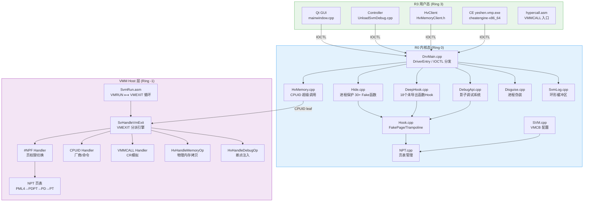

### 2.2 数据流总图

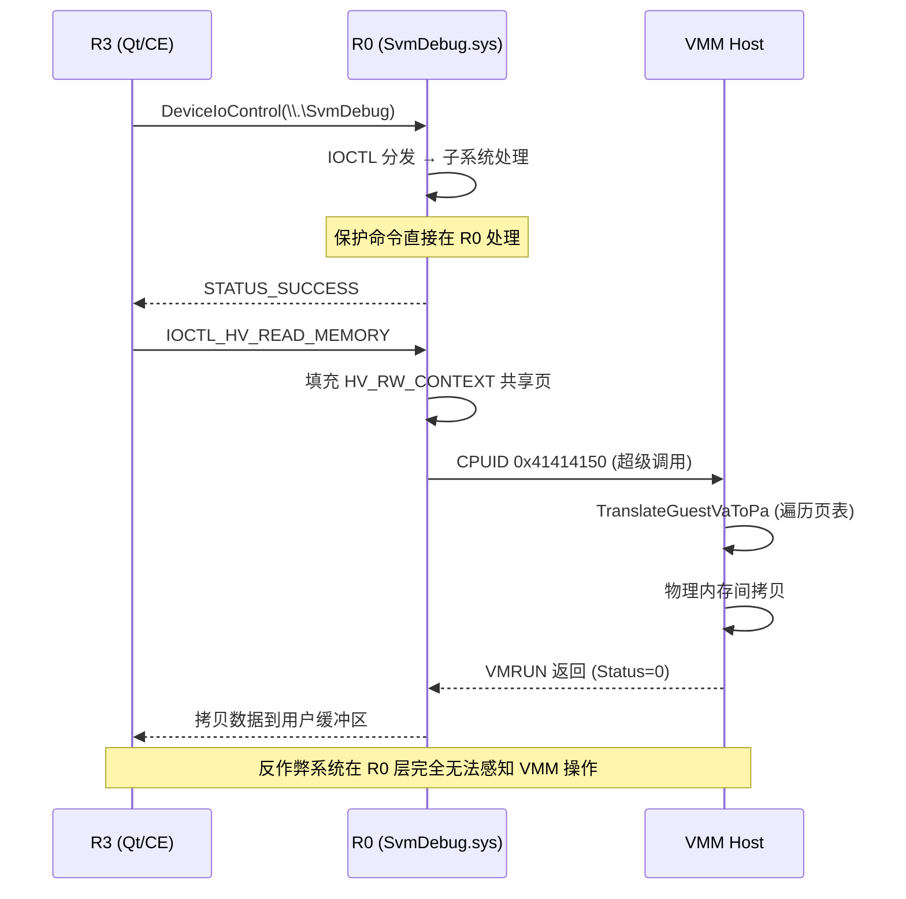

---

## 3. 权限层级模型

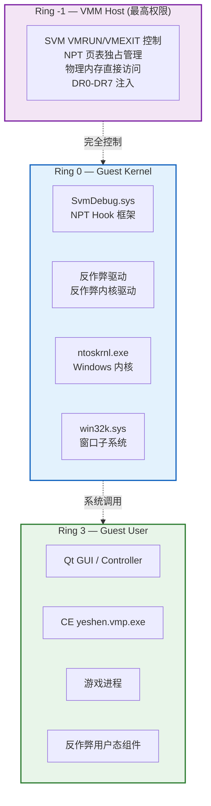

**核心优势**: VMM 运行在所有内核驱动之下 (Ring -1)，反作弊系统的内核驱动无法检测或干扰 VMM 的操作。NPT 页表由 VMM 独占管理，Guest 操作系统对页表替换完全无感知。反作弊系统在 Ring 0 所能使用的所有检测手段 (读取内存、枚举句柄、查询进程信息) 都已被 NPT Hook 拦截和伪造。

---

## 4. 模块依赖关系

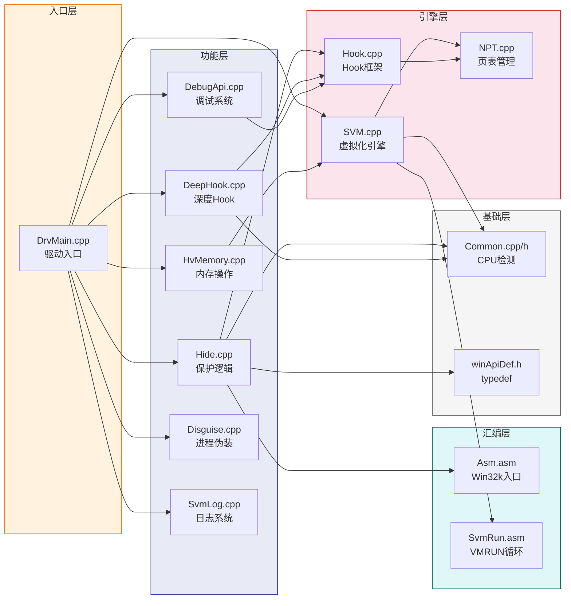

---

## 5. R3 用户态层

### 5.1 Qt GUI 控制器

**文件**: `main.cpp`, `mainwindow.cpp`, `mainwindow.h`, `mainwindow.ui`  
**窗口标题**: "YS启动器" | **尺寸**: 920 × 660 (最小)

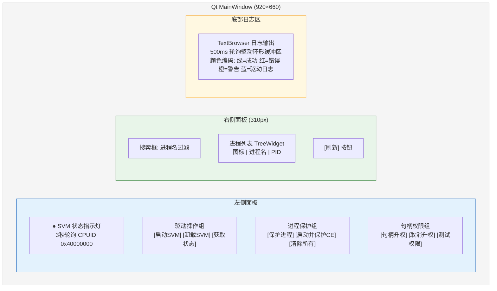

#### 5.1.1 定时器机制

| 定时器 | 间隔 | 实现 | 功能 |
|--------|------|------|------|
| `m_statusTimer` | 3000ms | `IsHypervisorPresent()` + `IsDeviceAvailable()` | CPUID 0x40000000 检测 Hypervisor 存活，更新状态指示灯 |
| `m_logPollTimer` | 500ms | `ReadDriverLog()` → `IOCTL_SVM_READ_LOG` | 从驱动环形缓冲区拉取日志，按关键词着色显示 |

#### 5.1.2 日志颜色编码规则

| 颜色代码 | 含义 | 匹配关键词 |
|----------|------|-----------|
| `#00aa00` (绿) | 操作成功 | `[OK]`, `SUCCESS`, `active` |
| `#cc0000` (红) | 错误 | `[ERROR]`, `[ERR]`, `[FAIL]` |
| `#cc8800` (橙) | 警告 | `[WARN]` |
| `#5599cc` (蓝) | 驱动日志 | 默认 (所有其他来自驱动端的日志) |
| `gray` | 时间戳 | `[hh:mm:ss]` 前缀 |

### 5.2 控制器后端 (UnloadSvmDebug.cpp/h)

为 Qt GUI 和控制台菜单提供的共用 API：

| 函数签名 | 功能描述 |
|---------|---------|
| `BOOL IsHypervisorPresent()` | 执行 `CPUID(0x40000000)`，检查厂商字符串是否为 `"VtDebugView "` (12字节，含尾部空格) |
| `BOOL IsDeviceAvailable()` | 尝试 `CreateFileW("\\\\.\\SvmDebug")` 并立即关闭，检测设备是否注册 |
| `BOOL LoadDriver()` | SCM `CreateService` + `StartService` → 轮询最多15秒等待 `IsHypervisorPresent()` 返回 TRUE |
| `BOOL UnloadDriver()` | 三步：① 终止 CE 进程 ② 停止 yeshen/dbk64 服务 ③ 停止 SvmDebug 服务 + 等待20秒清理 |
| `BOOL SendIoctl(code, buf, size)` | 打开设备 → `DeviceIoControl` → 关闭设备 (每次独立连接) |
| `BOOL CreateProcessAsSystem(cmd, pi)` | 复制 `winlogon.exe` 令牌 (`DuplicateTokenEx`) → `CreateProcessAsUserW` 以 SYSTEM 权限启动 |
| `int ReadDriverLog(outBuf, bufSize)` | `IOCTL_SVM_READ_LOG` 读取驱动环形缓冲区，返回实际字节数，0=无新日志，-1=设备不可用 |

### 5.3 R3 内存客户端 (HvMemoryClient.h)

纯头文件 C++ 类，封装通过 IOCTL 调用 Hypervisor 内存操作的完整 API：

```cpp
class HvClient {
    HANDLE hDevice;  // 设备句柄 (\\.\SvmDebug)

    bool Connect(deviceName = L"\\\\.\\SvmDebug");  // CreateFileW 打开设备
    void Disconnect();                                // CloseHandle
    bool IsConnected();

    // 保护相关
    bool SetProtectedProcess(DWORD pid, const wchar_t* processName);
    // → IOCTL 0x800, 发送 PROTECT_INFO 结构体

    // 内存读写 (通过 Hypervisor, 反作弊系统不可见)
    bool ReadMemory(DWORD targetPid, ULONG64 address, void* buffer, size_t size);
    // → IOCTL 0x810 (IOCTL_HV_READ_MEMORY)
    // → 输入: HV_MEMORY_REQUEST | 输出: 读取的原始数据

    bool WriteMemory(DWORD targetPid, ULONG64 address, const void* buffer, size_t size);
    // → IOCTL 0x811 (IOCTL_HV_WRITE_MEMORY)
    // → 输入: HV_MEMORY_REQUEST + 待写入数据 | 无输出

    // 模板便捷方法
    template<T> T Read(DWORD pid, ULONG64 addr);
    template<T> bool Write(DWORD pid, ULONG64 addr, const T& val);
};
```

### 5.4 VMMCALL 超级调用入口 (hypercall.asm)

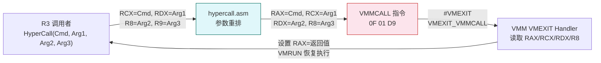

参数重排逻辑：Windows x64 调用约定的前 4 个参数在 RCX/RDX/R8/R9，但驱动端 VMCB 直接读取 `StateSaveArea.Rax` 作为命令码，因此 ASM 需要将 `RCX→RAX`, `RDX→RCX`, `R8→RDX`, `R9→R8`。

---

## 6. R0 内核驱动层

### 6.1 驱动入口 (DrvMain.cpp)

**设备名**: `\Device\SvmDebug` | **符号链接**: `\DosDevices\SvmDebug` (R3 通过 `\\.\SvmDebug` 访问)

#### 6.1.1 全局状态变量

| 变量名 | 类型 | 初始值 | 描述 |
|--------|------|--------|------|
| `g_nVMCB[64]` | `PVCPU_CONTEXT[]` | 全 NULL | per-CPU 虚拟化上下文指针数组 (最多64核) |
| `g_DeviceObject` | `PDEVICE_OBJECT` | NULL | 设备对象指针 |
| `g_SystemCr3` | `ULONG64` | 0 | System 进程的 CR3 (在 SvmInitSystemThread 中保存) |
| `g_DriverUnloading` | `volatile BOOLEAN` | FALSE | 卸载信号，置 TRUE 时通知工作线程退出 |
| `g_SuccessfulSvmCores` | `volatile LONG` | 0 | 成功进入虚拟化的 CPU 核心计数 |
| `g_PendingProtectPID` | `HANDLE` | 0 | 待保护 PID (R3 通过 IOCTL 设置) |
| `g_WorkerThreadHandle` | `HANDLE` | NULL | CommunicationThread 句柄 |
| `g_PendingCallbackOp` | `volatile LONG` | 0 | 待处理回调操作类型 |

#### 6.1.2 IOCTL 分发总表

| IOCTL Code | 宏名 | 模块 | 输入结构体 | 功能描述 |
|------------|------|------|-----------|---------|
| `0x00220810` | `IOCTL_HV_READ_MEMORY` | HvMemory | `HV_MEMORY_REQUEST` | 通过 Hypervisor 读取目标进程内存 |
| `0x00220811` | `IOCTL_HV_WRITE_MEMORY` | HvMemory | `HV_MEMORY_REQUEST` + data | 通过 Hypervisor 写入目标进程内存 |
| `0x00220820` | `IOCTL_SVM_PROTECT_PID` | Hide | `PROTECT_INFO` | 添加 PID 到保护列表 |
| `0x00220821` | `IOCTL_SVM_PROTECT_HWND` | Hide | `SVM_HWND` | 添加主窗口到保护列表 |
| `0x00220822` | `IOCTL_SVM_PROTECT_CHILD_HWND` | Hide | `SVM_HWND` | 添加子窗口到保护列表 |
| `0x00220823` | `IOCTL_SVM_CLEAR_ALL` | Hide | 无 | 清除所有保护和升权 |
| `0x00220824` | `IOCTL_SVM_DISABLE_CALLBACKS` | Hide | 无 | 禁用进程创建通知回调 |
| `0x00220825` | `IOCTL_SVM_RESTORE_CALLBACKS` | Hide | 无 | 恢复进程创建通知回调 |
| `0x00220826` | `IOCTL_SVM_PROTECT_EX` | Hide | `PROTECT_INFO_EX` | 扩展保护 (PID+HWND+子窗口) |
| `0x00220828` | `IOCTL_SVM_ELEVATE_PID` | Hide | `PROTECT_INFO` | 句柄升权 (绕过 反作弊系统降权) |
| `0x00220829` | `IOCTL_SVM_UNELEVATE_PID` | Hide | `PROTECT_INFO` | 取消句柄升权 |
| `0x00220830` | `IOCTL_DBG_REGISTER_DEBUGGER` | DebugApi | `DBG_REGISTER_REQUEST` | 注册调试器进程 |
| `0x00220831` | `IOCTL_DBG_ATTACH_PROCESS` | DebugApi | `DBG_ATTACH_REQUEST` | 附加到目标进程调试 |
| `0x00220832` | `IOCTL_DBG_DETACH_PROCESS` | DebugApi | `DBG_ATTACH_REQUEST` | 分离调试 |
| `0x00220833` | `IOCTL_DBG_SET_HW_BREAKPOINT` | DebugApi | `HW_BREAKPOINT_REQUEST` | 设置硬件断点 (DR0-DR3) |
| `0x00220834` | `IOCTL_DBG_REMOVE_HW_BREAKPOINT` | DebugApi | `HW_BREAKPOINT_REQUEST` | 移除硬件断点 |
| `0x00220835` | `IOCTL_DBG_SET_SW_BREAKPOINT` | DebugApi | `SW_BREAKPOINT_REQUEST` | 设置 NPT 隐形软件断点 |
| `0x00220836` | `IOCTL_DBG_REMOVE_SW_BREAKPOINT` | DebugApi | `SW_BREAKPOINT_REQUEST` | 移除软件断点 |
| `0x00220837` | `IOCTL_DBG_READ_SW_BREAKPOINT` | DebugApi | `SW_BREAKPOINT_REQUEST` | 读取断点原始字节 |
| `0x00220838` | `IOCTL_DBG_CONTINUE` | DebugApi | — | 继续调试 |
| `0x00220840` | `IOCTL_SVM_READ_LOG` | SvmLog | 无 | 读取驱动环形缓冲区日志 |

---

## 7. VMM Host 层 — SVM 引擎

### 7.1 VMRUN 循环 (SvmRun.asm)

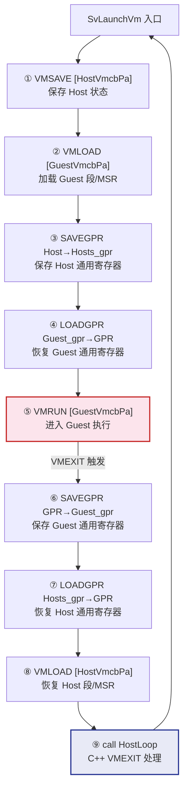

### 7.2 VMEXIT 分派引擎 (SvHandleVmExit)

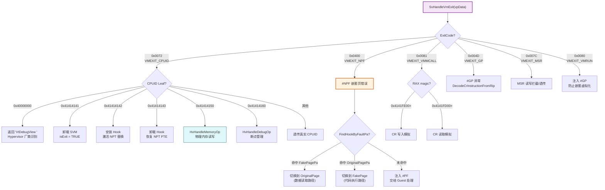

---

## 8. NPT 嵌套页表管理

### 8.1 四级页表结构

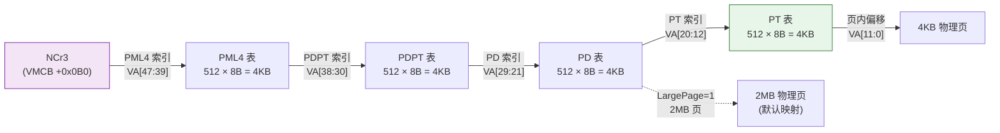

### 8.2 NPT_ENTRY 位域详解

```
NPT_ENTRY (8 字节 / 64 位)
╔═══════╤═════════════════════════════════════════════════════════════╗
║ Bit   │ 字段名                │ 描述                               ║
╠═══════╪═══════════════════════╪════════════════════════════════════╣
║ 0     │ Valid                 │ 存在位 (1=有效条目)                 ║
║ 1     │ Write                 │ 可写位 (0=只读)                    ║
║ 2     │ User                  │ 用户位 (Guest 用户态可访问)         ║
║ 3-6   │ Reserved1             │ 保留                               ║
║ 7     │ LargePage             │ 大页标志 (1=2MB/1GB 大页)          ║
║ 8     │ Reserved2             │ 保留                               ║
║ 9-11  │ Available             │ 软件可用位                          ║
║ 12-51 │ PageFrameNumber (PFN) │ 物理页帧号 (PA = PFN << 12)       ║
║ 52-62 │ Reserved3             │ 保留                               ║
║ 63    │ NoExecute (NX)        │ 不可执行位 (1=禁止执行)            ║
╚═══════╧═══════════════════════╧════════════════════════════════════╝
```

### 8.3 大页拆分流程

Hook 安装前，必须将目标函数所在的 2MB 大页拆分为 512 个 4KB 小页：

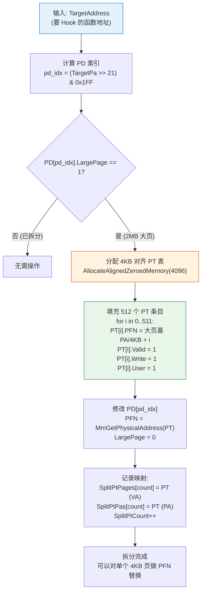

**设计要点**: `SplitPtPages[]` 和 `SplitPtPas[]` 一一对应，在 `PASSIVE_LEVEL` 拆分时记录 PA。这样 VMEXIT 高 IRQL 路径中查找 PT 表时直接比较 PA，无需调用 `MmGetPhysicalAddress` (该函数在高 IRQL 不安全)。

### 8.4 NPT 权限常量

| 常量 | 值 | 用途 |
|------|----|------|
| `NPT_PERM_READ_ONLY` | 1 | 设置页为只读 (拦截写入) |
| `NPT_PERM_EXECUTE` | 2 | 设置页为仅执行 (拦截读取) |
| `NPT_PERM_NOT_PRESENT` | 3 | 设置页不存在 (拦截所有访问) |
| `NPT_FLAGS` | 0x07 | 基本标志位 (V+W+U) |
| `NPT_LARGE_FLAGS` | 0x87 | 大页标志位 (V+W+U+LargePage) |

---

## 9. NPT Hook 框架

### 9.1 执行/读写分离原理

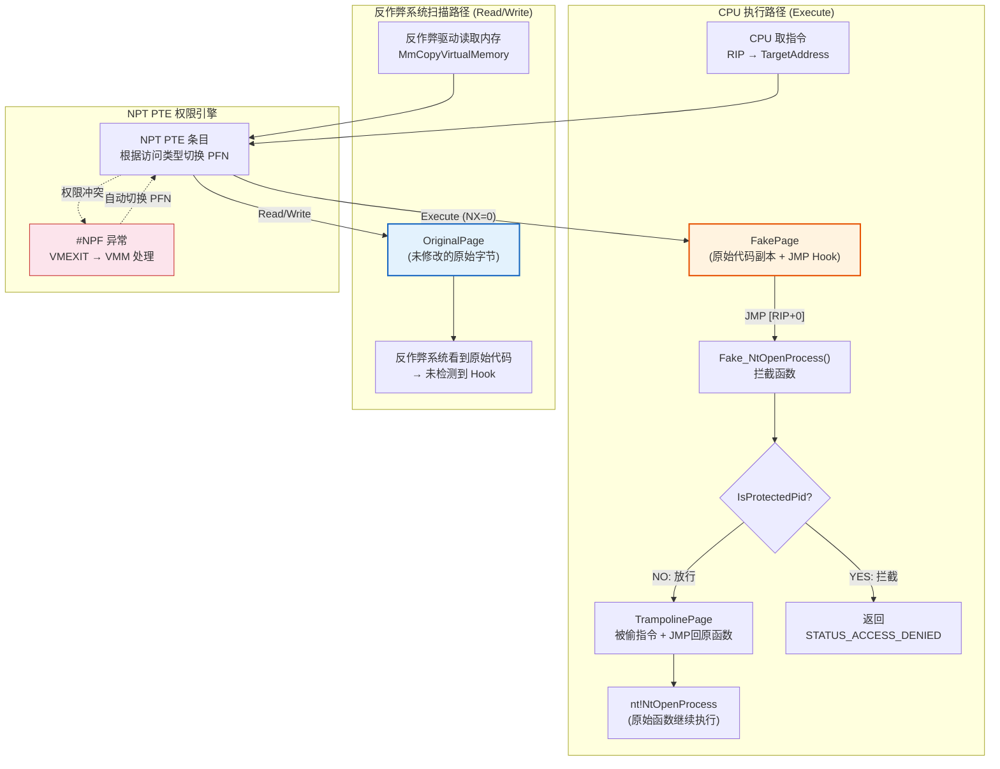

**核心原理**: 当 CPU 执行指令时 NPT PTE 指向 FakePage (含 JMP 跳转)。当 反作弊驱动读取同一地址的内存内容时，#NPF 异常触发 VMEXIT，VMM 将 PFN 切换到 OriginalPage (未修改的原始代码)。两个视图通过 NPT 权限位自动切换。

### 9.2 NPT_HOOK_CONTEXT 结构体 (Hook.h) — 完整字段注解

```
NPT_HOOK_CONTEXT — 每个被 Hook 的函数对应一个实例，存储在 g_HookList[HOOK_MAX_COUNT] 数组中

╔═══════════════════════╤══════════╤══════════════════════════════════════════════════════════╗
║ 字段名                 │ 类型      │ 描述                                                    ║
╠═══════════════════════╪══════════╪══════════════════════════════════════════════════════════╣
║ IsUsed                │ BOOLEAN  │ 此槽位是否已被占用 (TRUE=在使用)                          ║
║ ResourcesReady        │ BOOLEAN  │ FakePage/Trampoline 等资源是否全部就绪                    ║
╠═══════════════════════╪══════════╪══════════════════════════════════════════════════════════╣
║ TargetAddress         │ PVOID    │ 目标函数的虚拟地址 (如 nt!NtOpenProcess)                 ║
║ TargetPa              │ ULONG64  │ 目标函数的物理地址 (MmGetPhysicalAddress 转换)           ║
╠═══════════════════════╪══════════╪══════════════════════════════════════════════════════════╣
║ ProxyFunction         │ PVOID    │ 替代函数的虚拟地址 (如 Fake_NtOpenProcess)               ║
╠═══════════════════════╪══════════╪══════════════════════════════════════════════════════════╣
║ OriginalPageBase      │ PVOID    │ 目标函数所在 4KB 原始物理页的虚拟映射基地址 (页对齐)     ║
║ OriginalPagePa        │ ULONG64  │ 原始物理页的物理地址 (4KB 对齐)                          ║
║                       │          │ → 反作弊系统读取时 NPT PTE 指向此页                           ║
╠═══════════════════════╪══════════╪══════════════════════════════════════════════════════════╣
║ FakePage              │ PVOID    │ 伪造页的虚拟地址 — 复制原页内容后在目标偏移处写入 JMP     ║
║ FakePagePa            │ ULONG64  │ 伪造页的物理地址 — CPU 执行时 NPT PTE 指向此页           ║
╠═══════════════════════╪══════════╪══════════════════════════════════════════════════════════╣
║ TrampolinePage        │ PVOID    │ 跳板页虚拟地址 — 包含被覆盖的原始指令 + JMP 回原函数     ║
║ HookedBytes           │ SIZE_T   │ Hook 修改的字节数 (通常 14 = FF25 JMP + 8B地址)         ║
║ TrampolineLength      │ ULONG    │ 跳板总长度 = StolenBytesLength + 14(跳转指令)           ║
║ StolenBytesLength     │ ULONG    │ 被偷取的原始指令总长度 (≥14 字节, 按指令边界对齐)       ║
╚═══════════════════════╧══════════╧══════════════════════════════════════════════════════════╝
```

### 9.3 跳转指令模板

#### 14 字节绝对跳转 (RedirectInstruction) — 主要方案

```
字节布局:
  FF 25 00 00 00 00           ; JMP [RIP+0] — 跳转到紧随其后的8字节地址
  XX XX XX XX XX XX XX XX     ; 64位目标地址 (ProxyFunction 的虚拟地址)

总计: 14 字节
用途: 写入 FakePage 中目标函数偏移处
效果: CPU 执行到此处时跳转到 Fake_Xxx 拦截函数
```

#### 18 字节栈式跳转 (TrampolineStackZero) — 备选方案

```
字节布局:
  6A 00                       ; PUSH 0          — 压入占位符
  C7 44 24 04 XX XX XX XX     ; MOV [RSP+4], lo — 写入地址低32位
  C7 44 24 08 XX XX XX XX     ; MOV [RSP+8], hi — 写入地址高32位
  C3                          ; RET             — 弹出地址跳转

总计: 18 字节
优点: 不占用任何寄存器 (JMP [RIP+0] 方案依赖 RIP 相对寻址)
缺点: 多4字节，且修改栈帧
```

### 9.4 Trampoline 指令重定位 (7种类型)

`BuildTrampoline()` 将被 Hook 覆盖的原始指令复制到 TrampolinePage，并对 RIP 相关指令做重定位：

| 类型 | 原始指令格式 | 重定位策略 | 说明 |
|------|------------|-----------|------|
| ① CALL rel32 | `E8 XX XX XX XX` | 计算绝对目标地址 → `FF 15 [addr]` 间接调用 | 5B → 14B |
| ② JMP rel32 | `E9 XX XX XX XX` | 计算绝对目标地址 → `FF 25 [addr]` 绝对跳转 | 5B → 14B |
| ③ JMP rel8 | `EB XX` | 计算绝对目标地址 → `FF 25 [addr]` 绝对跳转 | 2B → 14B |
| ④ Jcc rel32 | `0F 8x XX XX XX XX` | 短条件跳转(`7x 02`) + `FF 25 [addr]` | 6B → 16B |
| ⑤ RIP-LEA | `48 8D ...` | `MOV reg, imm64` (10字节绝对地址加载) | 可变 |
| ⑥ RIP-MOV | `48 8B ...` | `MOV reg, imm64` + `MOV reg, [reg]` | 可变 |
| ⑦ MOV CRn | `0F 22/20 ...` | 转换为 `VMMCALL` (避免在 Trampoline 中触发 #GP) | 特殊 |

---

## 10. 进程保护系统 (Hide)

### 10.1 五层纵深防御模型

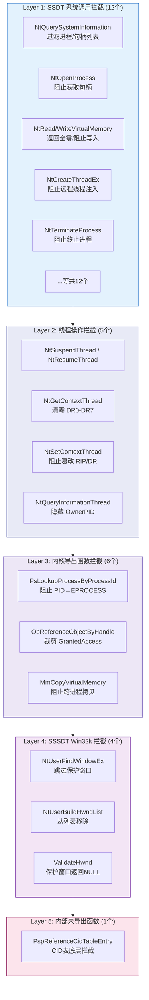

### 10.2 多目标保护配置

| 保护列表 | 全局数组 | 最大数量 | 原子操作 |
|---------|---------|---------|---------|
| 保护进程 PID | `g_ProtectedPIDs[20]` | 20 | `InterlockedIncrement(&g_ProtectedPidCount)` |
| 升权进程 PID | `g_ElevatedPIDs[10]` | 10 | `InterlockedIncrement(&g_ElevatedPidCount)` |
| 主窗口句柄 | `g_ProtectedHwnds[20]` | 20 | `InterlockedIncrement(&g_ProtectedHwndCount)` |
| 子窗口句柄 | `g_ProtectedChildHwnds[256]` | 256 | `InterlockedIncrement(&g_ProtectedChildHwndCount)` |
| 主保护 PID | `g_ProtectedPID` | 1 | 兼容旧接口的单一 PID |

### 10.3 句柄升权 (Elevate) 机制

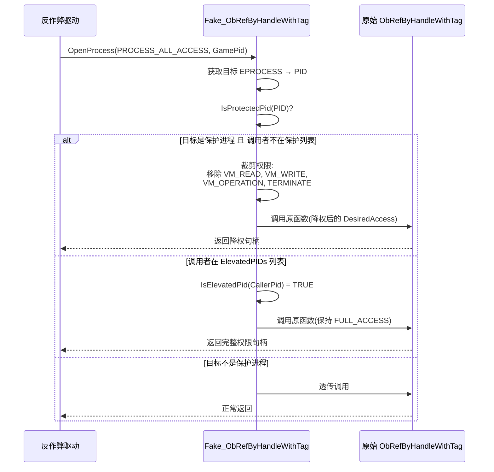

### 10.4 ASM 代理入口 (Asm.asm) — NtUserBuildHwndList

Win32k SSSDT 函数 `NtUserBuildHwndList` 有 **8 个参数** (超过 x64 调用约定的 4 个寄存器参数)，需要汇编代理保存完整寄存器上下文：

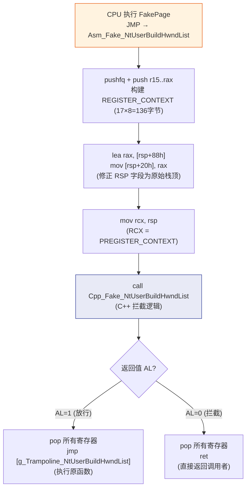

---

## 11. 深度内核拦截 (DeepHook)

### 11.1 Phase 1 — 核心内核函数 (11个)

| # | 目标函数 | 分类 | 拦截目的 | 定位方式 |
|---|---------|------|---------|---------|
| 1 | `ObReferenceObjectByHandleWithTag` | 对象管理 | 句柄→对象引用时裁剪权限 | 特征码扫描 |
| 2 | `ObfDereferenceObject` | 对象管理 | 引用计数监控 | 特征码扫描 |
| 3 | `ObfDereferenceObjectWithTag` | 对象管理 | 带Tag引用计数监控 | 特征码扫描 |
| 4 | `PspInsertThread` | 进程/线程 | 拦截新线程插入保护进程 | 特征码扫描 |
| 5 | `PspCallThreadNotifyRoutines` | 进程/线程 | 控制线程创建通知分发 | 特征码扫描 |
| 6 | `PspExitThread` | 进程/线程 | 监控保护进程线程退出 | 特征码扫描 |
| 7 | `MmProtectVirtualMemory` (内部) | 内存/VAD | 阻止修改保护进程内存属性 | 特征码扫描 |
| 8 | `MiObtainReferencedVadEx` | 内存/VAD | 阻止获取保护进程 VAD 信息 | 特征码扫描 |
| 9 | `KiDispatchException` | 异常/调度 | 隐藏调试异常，控制异常分派 | 特征码扫描 |
| 10 | `KiStackAttachProcess` | 异常/调度 | 监控进程地址空间切换 | 特征码扫描 |
| 11 | `ObpReferenceObjectByHandleWithTag` | 对象管理 | 内部版本拦截 | 特征码扫描 |

### 11.2 Phase 2 — 高级防御 (7个)

| # | 目标函数 | 攻击场景 | 防御效果 |
|---|---------|---------|---------|
| 12 | `KiInsertQueueApc` | 反作弊系统通过 APC 注入代码到保护进程线程 | 拦截目标为保护线程的 APC 插入 |
| 13 | `MmGetPhysicalAddress` | 反作弊系统获取保护进程物理页地址后直接物理读取 | 对保护进程地址返回伪造 PA |
| 14 | `MmMapIoSpace` | 反作弊系统通过 MmMapIoSpace 映射保护进程物理内存 | 拦截映射保护进程物理地址范围的请求 |
| 15 | `MmMapLockedPagesSpecifyCache` | 反作弊系统通过 MDL 锁定+映射读取保护内存 | 拦截 MDL 指向保护进程内存的映射 |
| 16 | `ExpLookupHandleTableEntry` | 反作弊系统遍历 PspCidTable 发现保护进程 | 从 CID 表查询结果中隐藏保护对象 |
| 17 | `PspInsertProcess` | 在进程暴露给系统前拦截 | 掌控进程生命周期源头 |
| 18 | `PspGetContextThreadInternal` | 反作弊系统绕过 NtGetContextThread 直接调用底层函数读取 DR0-DR7 | 底层清除硬件断点寄存器 |

### 11.3 特征码扫描引擎

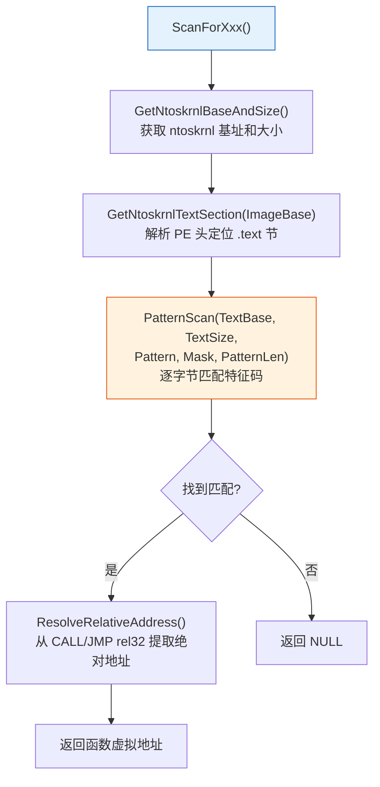

---

## 12. 影子调试系统 (DebugApi)

### 12.1 标准 vs 影子调试路径对比

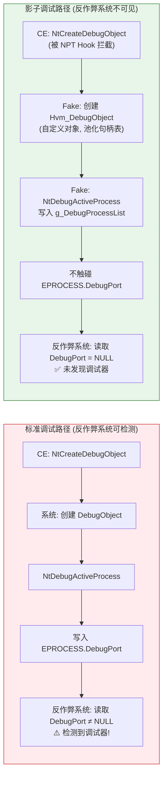

### 12.2 核心结构体

#### DEBUG_OBJECT — 自定义调试对象

```
DEBUG_OBJECT (替代系统 DbgkDebugObjectType)
╔═══════════════════════╤══════════════════╤══════════════════════════════════════════════════╗
║ 字段                   │ 类型              │ 描述                                            ║
╠═══════════════════════╪══════════════════╪══════════════════════════════════════════════════╣
║ EventsPresent         │ KEVENT           │ 有调试事件时置信号态, WaitForDebugEvent 等待此事件║
║ Mutex                 │ FAST_MUTEX       │ 保护 EventList 的互斥锁                         ║
║ EventList             │ LIST_ENTRY       │ 调试事件链表头 (DEBUG_EVENT 节点)                ║
║ Flags                 │ ULONG (位域)      │ bit0: DebuggerInactive                         ║
║                       │                  │ bit1: KillProcessOnExit (调试器退出时终止被调试者)║
╚═══════════════════════╧══════════════════╧══════════════════════════════════════════════════╝
```

#### DEBUG_EVENT — 调试事件节点

```
DEBUG_EVENT (链接在 DEBUG_OBJECT.EventList 上)
╔═══════════════════════╤══════════════════╤══════════════════════════════════════════════════╗
║ 字段                   │ 类型              │ 描述                                            ║
╠═══════════════════════╪══════════════════╪══════════════════════════════════════════════════╣
║ EventList             │ LIST_ENTRY       │ 链表节点                                        ║
║ ContinueEvent        │ KEVENT           │ DebugContinue 时置信号态, 唤醒被挂起的线程       ║
║ ClientId              │ CLIENT_ID        │ 事件来源的进程PID + 线程TID                     ║
║ Process               │ PEPROCESS        │ 来源进程对象                                    ║
║ Thread                │ PETHREAD         │ 来源线程对象                                    ║
║ Status                │ NTSTATUS         │ 事件状态码                                      ║
║ Flags                 │ ULONG            │ DEBUG_EVENT_READ / INACTIVE / NOWAIT / RELEASE  ║
║ BackoutThread         │ PETHREAD         │ 回退线程 (异常处理用)                           ║
║ ApiMsg                │ DBGKM_APIMSG     │ 调试消息体 (异常/线程创建/DLL加载等7种类型)     ║
╚═══════════════════════╧══════════════════╧══════════════════════════════════════════════════╝
```

#### 池化句柄表

```
句柄管理 (替代 ObCreateObjectType):
  g_DbgHandleTable[16]          — PDEBUG_OBJECT 指针数组, 最多16个调试对象
  DBG_HANDLE_BASE = 0xDB000000  — 句柄基址 (与系统句柄空间 [0, 0x10000000) 不冲突)

  转换公式:
    句柄 → 索引: DBG_HANDLE_TO_INDEX(h) = (ULONG)((ULONG64)(h) - 0xDB000000)
    索引 → 句柄: DBG_INDEX_TO_HANDLE(i) = (HANDLE)(0xDB000000 + (ULONG64)(i))
    有效性检查: DBG_IS_VALID_HANDLE(h) = (h >= 0xDB000000 && h < 0xDB000010)
```

### 12.3 NPT 隐形断点结构体

```
NPT_BREAKPOINT (最多 MAX_NPT_BREAKPOINTS=64 个)
╔═══════════════════════╤══════════════╤══════════════════════════════════════════════════════╗
║ 字段                   │ 类型          │ 描述                                                ║
╠═══════════════════════╪══════════════╪══════════════════════════════════════════════════════╣
║ IsActive              │ BOOLEAN      │ 断点是否激活                                        ║
║ TargetPid             │ ULONG64      │ 目标进程 PID                                       ║
║ TargetCr3             │ ULONG64      │ 目标进程 CR3 (页表根)                              ║
║ VirtualAddress        │ ULONG64      │ 断点虚拟地址                                       ║
║ PhysicalAddress       │ ULONG64      │ 断点所在物理页基址 (4KB 对齐)                      ║
║ PageOffset            │ ULONG        │ 页内偏移 (VA & 0xFFF)                              ║
║ OriginalByte          │ UCHAR        │ 被替换的原始字节 (恢复时写回)                      ║
║ HookSlotIndex         │ LONG         │ 对应的 g_HookList 槽位索引 (-1=未分配)             ║
║ IsSingleStepping      │ BOOLEAN      │ 是否正在单步恢复中 (执行一条后重设断点)            ║
║ OwnerThread           │ HANDLE       │ 触发断点的线程 (用于单步恢复时识别)                ║
╚═══════════════════════╧══════════════╧══════════════════════════════════════════════════════╝

Execute/Read 分离断点原理:
  Original Page (R/W) → 反作弊系统扫描时看到原始指令 (无 0xCC)
  Fake Page (X)       → CPU 执行时命中 0xCC → #BP 异常在 VMCB 层拦截
                         不进入 Guest IDT → 反作弊系统的 VEH/SEH 完全无感知
```

### 12.4 被替换的调试 API (13个)

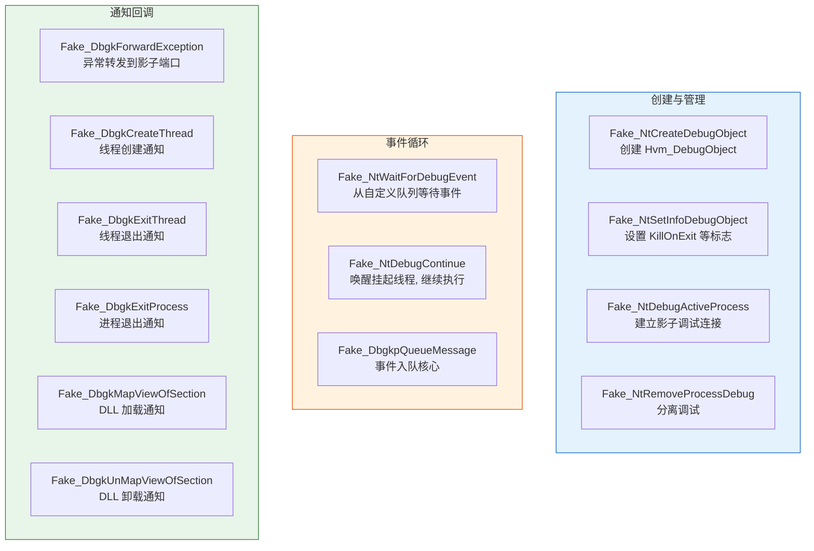

---

## 13. Hypervisor 内存操作 (HvMemory)

### 13.1 通信架构

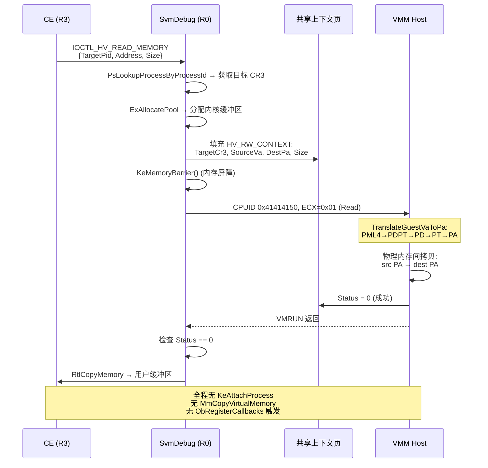

### 13.2 HV_RW_CONTEXT 共享上下文

```
HV_RW_CONTEXT (分配为物理连续页, Guest↔VMM 共享)
╔═══════════════════════╤══════════════╤══════════════════════════════════════════════════════════╗
║ 字段                   │ 类型          │ 描述                                                    ║
╠═══════════════════════╪══════════════╪══════════════════════════════════════════════════════════╣
║ TargetCr3             │ ULONG64      │ 目标进程的 CR3 (DirectoryTableBase)                    ║
║                       │              │ KPROCESS+0x28 偏移读取, Win10 全版本一致                ║
╠═══════════════════════╪══════════════╪══════════════════════════════════════════════════════════╣
║ SourceVa              │ ULONG64      │ 目标进程中的虚拟地址 (要读/写的地址)                    ║
╠═══════════════════════╪══════════════╪══════════════════════════════════════════════════════════╣
║ DestPa                │ ULONG64      │ 内核缓冲区的物理地址 (数据传输目标)                     ║
║                       │              │ R0 端通过 MmGetPhysicalAddress 获取                     ║
╠═══════════════════════╪══════════════╪══════════════════════════════════════════════════════════╣
║ Size                  │ ULONG64      │ 传输字节数 (单次最大 PAGE_SIZE)                         ║
╠═══════════════════════╪══════════════╪══════════════════════════════════════════════════════════╣
║ IsWrite               │ ULONG64      │ 操作方向: 0=读取目标内存, 1=写入目标内存                ║
╠═══════════════════════╪══════════════╪══════════════════════════════════════════════════════════╣
║ Status                │ volatile LONG│ 操作结果: 0=成功, 1=待处理, 负数=错误码                 ║
╚═══════════════════════╧══════════════╧══════════════════════════════════════════════════════════╝
```

### 13.3 VMM 侧四级页表遍历

```
TranslateGuestVaToPa_Ext(GuestCr3, GuestVa):

  虚拟地址分解 (48位有效):
    PML4 索引 = (GuestVa >> 39) & 0x1FF   [bit 47:39]
    PDPT 索引 = (GuestVa >> 30) & 0x1FF   [bit 38:30]
    PD   索引 = (GuestVa >> 21) & 0x1FF   [bit 29:21]
    PT   索引 = (GuestVa >> 12) & 0x1FF   [bit 20:12]
    页内偏移  = GuestVa & 0xFFF            [bit 11:0]

  遍历算法:
    ① PML4E = *(GuestCr3 + PML4索引 × 8)
       if PML4E.Present == 0 → 返回 0 (页不存在)
    ② PDPTE = *(PML4E.PFN << 12 + PDPT索引 × 8)
       if PDPTE.Present == 0 → 返回 0
       if PDPTE.LargePage == 1 → PA = (PDPTE.PFN << 30) | (GuestVa & 0x3FFFFFFF)  [1GB页]
    ③ PDE = *(PDPTE.PFN << 12 + PD索引 × 8)
       if PDE.Present == 0 → 返回 0
       if PDE.LargePage == 1 → PA = (PDE.PFN << 21) | (GuestVa & 0x1FFFFF)  [2MB页]
    ④ PTE = *(PDE.PFN << 12 + PT索引 × 8)
       if PTE.Present == 0 → 返回 0
       PA = (PTE.PFN << 12) | (GuestVa & 0xFFF)  [4KB页]
```

---

## 14. 进程伪装系统 (Disguise)

### 14.1 伪装流程

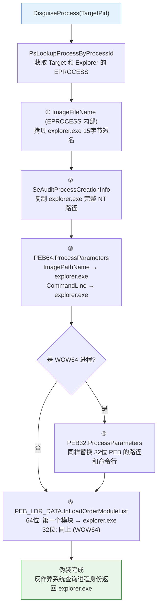

### 14.2 被伪装的身份字段

| 层级 | 字段 | 原始值 (示例) | 伪装后 |
|------|------|-------------|--------|
| EPROCESS | ImageFileName | `yeshen.vmp.exe` | `explorer.exe` |
| EPROCESS | SeAuditProcessCreationInfo | `\Device\HarddiskVolume3\CE\yeshen.vmp.exe` | explorer.exe 完整路径 |
| PEB64 | ProcessParameters.ImagePathName | CE 路径 | `C:\Windows\explorer.exe` |
| PEB64 | ProcessParameters.CommandLine | CE 命令行 | explorer.exe 命令行 |
| PEB32 | ProcessParameters (WOW64) | 同上 (32位版) | 同上 (32位版) |
| PEB_LDR_DATA | InLoadOrderModuleList[0].FullDllName | `yeshen.vmp.exe` | `explorer.exe` |
| PEB_LDR_DATA | InLoadOrderModuleList[0].BaseDllName | `yeshen.vmp.exe` | `explorer.exe` |

---

## 15. CE dbk64 桥接层

### 15.1 HvMemBridge 替换方案

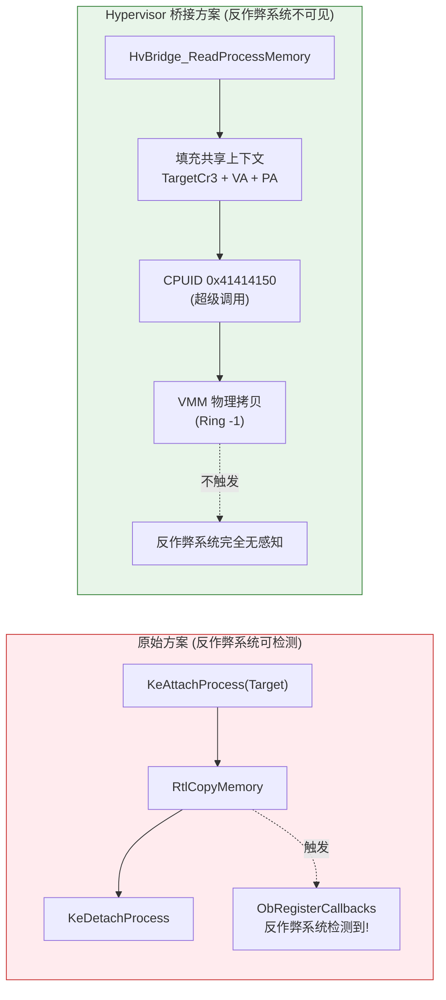

**集成方法**: 在 CE dbk64 驱动工程中将 `memscan.c` 的 `ReadProcessMemory`/`WriteProcessMemory` 替换为 `HvBridge_ReadProcessMemory`/`HvBridge_WriteProcessMemory`，或取消注释 `HvMemBridge.h` 底部的 `#define` 宏自动重定向。

### 15.2 CE 模块文件职责

| 文件 | 行数 | 职责 |
|------|------|------|
| `HvMemBridge.c/h` | 350 | 超级调用内存读写替代实现，含 Hypervisor 存在检测 |
| `IOPLDispatcher.c/h` | 2743 | CE 原始 IOCTL 分发器，100+ 个 IOCTL (0x0800-0x0862) |
| `debugger.c/h` | 1914 | CE 内核调试器 (断点管理/LBR/调试事件等待/状态查询) |
| `interruptHook.c/h` | 277 | IDT 中断 Hook (INT1/INT3/INT14，支持 DBVM 虚拟化路径) |
| `deepkernel.c/h` | 181 | 页表写保护操作 (MakeWritable/MakeWritableKM) |
| `extradefines.h` | 20 | 未导出内核 API (ObOpenObjectByName) |
| `extraimports.h` | 11 | 未导出内核 API (KeAddSystemServiceTable) |

---

## 16. 日志系统 (SvmLog)

### 16.1 环形缓冲区架构

```mermaid
graph LR
    subgraph R0_Writers["R0 写入端 (多核并发)"]
        CPU0["CPU 0<br/>SvmDebugPrint()"]
        CPU1["CPU 1<br/>SvmDebugPrint()"]
        CPUn["CPU N<br/>SvmDebugPrint()"]
    end

    subgraph Ring["SVM_LOG_RING_BUFFER"]
        WI["WriteIndex (atomic)<br/>InterlockedIncrement"]
        RI["ReadIndex<br/>IOCTL 读取时推进"]
        BUF["Buffer[256][512]<br/>256 条 × 512 字节/条<br/>总计 128KB"]
    end

    subgraph R3_Reader["R3 读取端"]
        Qt["Qt GUI<br/>m_logPollTimer (500ms)"]
        IOCTL["IOCTL_SVM_READ_LOG<br/>(0x00220840)"]
    end

    CPU0 -->|"原子写入"| WI
    CPU1 -->|"原子写入"| WI
    CPUn -->|"原子写入"| WI
    WI --> BUF
    Qt -->|"轮询"| IOCTL --> RI
    RI --> BUF

    style Ring fill:#fff3e0,stroke:#e65100
```

```
SVM_LOG_RING_BUFFER 结构体:
╔═══════════════════════╤══════════════════════╤═══════════════════════════════════════════════╗
║ 字段                   │ 类型                  │ 描述                                         ║
╠═══════════════════════╪══════════════════════╪═══════════════════════════════════════════════╣
║ WriteIndex            │ volatile LONG        │ 下一个写入槽位 (InterlockedIncrement 原子递增) ║
║ ReadIndex             │ volatile LONG        │ 下一个读取槽位 (IOCTL 处理时串行推进)         ║
║ Buffer[256][512]      │ CHAR[][]             │ 256 条日志 × 512 字节/条 (含 '\0')           ║
╚═══════════════════════╧══════════════════════╧═══════════════════════════════════════════════╝

设计特点:
  • 无锁单生产者: WriteIndex 原子递增, 槽位独占
  • 支持 <= DISPATCH_LEVEL 调用 (VMEXIT 处理中也可写入)
  • 环形覆盖: 满时旧日志被新日志覆盖 (环形语义)
  • 2的幂取模: idx = slot & (256 - 1), 避免除法
  • R3 落后太多时自动跳到最新可读位置
```

### 16.2 双通道输出

```
SvmDebugPrint(Format, ...):
  ├── ① DbgPrintEx(DPFLTR_IHVDRIVER_ID, DPFLTR_ERROR_LEVEL, ...)
  │   └── WinDbg / DbgView 可实时查看
  │
  └── ② SvmLogWrite(...)
      └── 写入环形缓冲区 → R3 Qt GUI 通过 IOCTL 轮询读取
```

---

## 17. 核心数据结构详解

### 17.1 VCPU_CONTEXT — per-CPU 虚拟化上下文 (SVM.h)

这是整个系统最核心的结构体，每个 CPU 核心拥有一个实例，以 PAGE_SIZE 对齐分配。

```
VCPU_CONTEXT (PAGE 对齐分配, 每个 CPU 核心一个)
╔═══════════════════════════════╤══════════════════════════════╤════════════════════╤══════════════════════════════════════════╗
║ 字段                           │ 类型                          │ 偏移 (近似)        │ 描述                                    ║
╠═══════════════════════════════╪══════════════════════════════╪════════════════════╪══════════════════════════════════════════╣
║ isExit                        │ BOOLEAN                      │ +0x0000            │ 退出标志, TRUE 时 VMRUN 循环终止         ║
╠═══════════════════════════════╪══════════════════════════════╪════════════════════╪══════════════════════════════════════════╣
║ Guestvmcb                     │ VMCB (PAGE_SIZE 对齐)        │ +0x1000            │ Guest VMCB — 控制区 + 状态保存区 (4KB)  ║
║                               │                              │                    │ VMRUN 指令直接操作此结构体              ║
╠═══════════════════════════════╪══════════════════════════════╪════════════════════╪══════════════════════════════════════════╣
║ Hostvmcb                      │ VMCB (PAGE_SIZE 对齐)        │ +0x2000            │ Host VMCB — VMSAVE/VMLOAD 使用          ║
╠═══════════════════════════════╪══════════════════════════════╪════════════════════╪══════════════════════════════════════════╣
║ Guest_gpr                     │ GUEST_GPR (120B)             │ +0x3000            │ Guest 通用寄存器快照 (RAX-R15)          ║
║ Hosts_gpr                     │ GUEST_GPR (120B)             │ +0x3078            │ Host 通用寄存器快照                     ║
╠═══════════════════════════════╪══════════════════════════════╪════════════════════╪══════════════════════════════════════════╣
║ GuestVmcbPa                   │ UINT64                       │ +0x30F0            │ Guest VMCB 物理地址 (VMRUN 参数)        ║
║ HostVmcbPa                    │ UINT64                       │ +0x30F8            │ Host VMCB 物理地址                      ║
║ Guest_Thread                  │ HANDLE                       │ +0x3100            │ Guest 线程句柄                          ║
╠═══════════════════════════════╪══════════════════════════════╪════════════════════╪══════════════════════════════════════════╣
║ HostSaveArea[PAGE_SIZE]       │ UINT8[] (PAGE_SIZE 对齐)     │                    │ SVM Host 状态保存区 (MSR_VM_HSAVE_PA)   ║
╠═══════════════════════════════╪══════════════════════════════╪════════════════════╪══════════════════════════════════════════╣
║ GuestStackBase / GuestStackTop│ PVOID / UINT64               │                    │ Guest 独立栈 (0x6000 字节)              ║
║ GuestCodeBase                 │ PVOID                        │                    │ Guest 代码区域基址                      ║
║ HostStackBase / HostStackTop  │ PVOID / UINT64               │                    │ Host 独立栈 (VMEXIT 处理使用)           ║
╠═══════════════════════════════╪══════════════════════════════╪════════════════════╪══════════════════════════════════════════╣
║ ProcessorIndex                │ ULONG32                      │                    │ CPU 核心编号 (0, 1, 2, ...)             ║
║ NptCr3                        │ ULONG64                      │                    │ NPT 页表根物理地址 (写入 VMCB.NCr3)    ║
╠═══════════════════════════════╪══════════════════════════════╪════════════════════╪══════════════════════════════════════════╣
║ pml4_table                    │ ULONG64*                     │                    │ PML4 表虚拟地址 (512 条目)              ║
║ pdpt_table                    │ ULONG64*                     │                    │ PDPT 表虚拟地址 (512 条目)              ║
║ pd_tables                     │ ULONG64*                     │                    │ PD 表组虚拟地址 (4×512 条目)            ║
║ New_pd_tables                 │ ULONG64*                     │                    │ 新分配的 PD 表 (扩展用)                 ║
╠═══════════════════════════════╪══════════════════════════════╪════════════════════╪══════════════════════════════════════════╣
║ SplitPtPages[4096]            │ PVOID[]                      │                    │ 拆分后 PT 页虚拟地址 (与 SplitPtPas 对应)║
║ SplitPtPas[4096]              │ ULONG64[]                    │                    │ 拆分后 PT 页物理地址                    ║
║ SplitPtCount                  │ ULONG                        │                    │ 已拆分的大页数量                        ║
╠═══════════════════════════════╪══════════════════════════════╪════════════════════╪══════════════════════════════════════════╣
║ ActiveHook                    │ PVOID                        │                    │ 当前正在执行的 Hook 上下文指针          ║
║ SuspendedHook                 │ PVOID                        │                    │ 被挂起的 Hook 上下文指针                ║
╚═══════════════════════════════╧══════════════════════════════╧════════════════════╧══════════════════════════════════════════╝
```

### 17.2 VMCB — 虚拟机控制块 (Common.h)

```
VMCB = VMCB_CONTROL_AREA (0x400) + VMCB_STATE_SAVE_AREA (0xC00) = 0x1000 (4KB, 恰好一页)

VMCB_CONTROL_AREA (偏移 0x000 - 0x3FF, 1024 字节) — 控制 VMEXIT 行为:
╔════════════╤════════════════════════════╤══════════════════════════════════════════════════════╗
║ 偏移        │ 字段                        │ 描述                                                ║
╠════════════╪════════════════════════════╪══════════════════════════════════════════════════════╣
║ +0x000     │ InterceptCrRead  (UINT16)  │ CR0-CR15 读取拦截位图 (每位对应一个CR)              ║
║ +0x002     │ InterceptCrWrite (UINT16)  │ CR0-CR15 写入拦截位图                              ║
║ +0x004     │ InterceptDrRead  (UINT16)  │ DR0-DR15 读取拦截位图                              ║
║ +0x006     │ InterceptDrWrite (UINT16)  │ DR0-DR15 写入拦截位图                              ║
║ +0x008     │ InterceptException (UINT32)│ 异常拦截位图 (bit0=#DE, bit1=#DB, bit3=#BP, ...)   ║
║ +0x00C     │ InterceptMisc1   (UINT32)  │ bit14=RDTSC, bit18=CPUID, bit28=MSR_PROT          ║
║ +0x010     │ InterceptMisc2   (UINT32)  │ bit0=VMRUN, bit1=VMMCALL, bit7=RDTSCP             ║
║ +0x048     │ MsrpmBasePa      (UINT64)  │ MSR 权限位图的物理地址 (8KB)                       ║
║ +0x050     │ TscOffset         (UINT64)  │ Guest TSC = 物理TSC + TscOffset                   ║
║ +0x058     │ GuestAsid         (UINT32)  │ 地址空间ID (必须≥1, 0=Host)                       ║
║ +0x05C     │ TlbControl        (UINT32)  │ 0=无操作, 1=全刷新TLB                             ║
║ +0x070     │ ExitCode          (UINT64)  │ VMEXIT 原因码 (0x72=CPUID, 0x400=#NPF, ...)      ║
║ +0x078     │ ExitInfo1         (UINT64)  │ VMEXIT 附加信息1 (#NPF时=Guest物理地址)           ║
║ +0x080     │ ExitInfo2         (UINT64)  │ VMEXIT 附加信息2 (#NPF时=错误码)                 ║
║ +0x090     │ NpEnable          (UINT64)  │ bit0=1 启用NPT嵌套页表                            ║
║ +0x0A8     │ EventInj          (UINT64)  │ 事件注入 (EVENTINJ格式: Vector+Type+ErrorCode)    ║
║ +0x0B0     │ NCr3              (UINT64)  │ ★ NPT CR3 — 嵌套页表根物理地址 (核心字段)        ║
║ +0x0C0     │ VmcbClean         (UINT64)  │ VMCB缓存控制 (0=强制重读所有字段)                ║
║ +0x0C8     │ NRip              (UINT64)  │ 下一条指令RIP (NRIP Save功能)                    ║
╚════════════╧════════════════════════════╧══════════════════════════════════════════════════════╝

VMCB_STATE_SAVE_AREA (偏移 0x400 - 0xFFF, 3072 字节) — Guest CPU 状态:
╔════════════╤════════════════════════════╤══════════════════════════════════════════════════════╗
║ 偏移        │ 字段                        │ 描述                                                ║
╠════════════╪════════════════════════════╪══════════════════════════════════════════════════════╣
║ +0x400     │ ES/CS/SS/DS/FS/GS         │ 段寄存器 (各16B: Selector+Attrib+Limit+Base)       ║
║ +0x460     │ GDTR/LDTR/IDTR/TR         │ 系统表寄存器 (各16B)                               ║
║ +0x4CB     │ Cpl                        │ 当前特权级 (0/3)                                   ║
║ +0x4D0     │ Efer                       │ 扩展特性使能寄存器 (bit12=SVME)                    ║
║ +0x548     │ Cr4                        │ 控制寄存器 CR4                                     ║
║ +0x550     │ Cr3                        │ Guest CR3 (Guest 自己的页表基址)                   ║
║ +0x558     │ Cr0                        │ 控制寄存器 CR0                                     ║
║ +0x560     │ Dr7 / Dr6                  │ 调试寄存器                                         ║
║ +0x570     │ Rflags                     │ 标志寄存器                                         ║
║ +0x578     │ Rip                        │ 指令指针 (Guest 当前 RIP)                          ║
║ +0x5D8     │ Rsp                        │ 栈指针                                             ║
║ +0x5F8     │ Rax                        │ 通用寄存器 RAX (其余在 GUEST_GPR)                  ║
║ +0x600     │ Star/LStar/CStar/SfMask    │ SYSCALL/SYSRET 相关 MSR                           ║
║ +0x628     │ KernelGsBase               │ SWAPGS 目标 (MSR 0xC0000102)                      ║
║ +0x630     │ SysenterCs/Esp/Eip         │ SYSENTER 相关 MSR                                 ║
║ +0x648     │ Cr2                        │ 页错误线性地址                                     ║
║ +0x668     │ GPat                       │ Guest PAT MSR                                      ║
╚════════════╧════════════════════════════╧══════════════════════════════════════════════════════╝
```

### 17.3 REGISTER_CONTEXT — VMEXIT GPR 快照 (Hook.h)

```
#pragma pack(push, 1)  // 无填充, 与汇编 push 顺序严格匹配

REGISTER_CONTEXT (136 字节 = 17 × 8)
╔════════════╤══════════╤════════════════════════════════════════════════════════════════════════╗
║ 偏移        │ 字段      │ 描述                                                                ║
╠════════════╪══════════╪════════════════════════════════════════════════════════════════════════╣
║ +0x00      │ Rax      │ 通用寄存器 RAX — 常用于返回值, Fake 函数可修改此字段伪造返回值        ║
║ +0x08      │ Rcx      │ 通用寄存器 RCX — Windows x64 第1个参数                               ║
║ +0x10      │ Rdx      │ 通用寄存器 RDX — 第2个参数                                           ║
║ +0x18      │ Rbx      │ 通用寄存器 RBX — 被调用者保存                                        ║
║ +0x20      │ Rsp      │ 栈指针 RSP — ASM 中修正为原始 RSP (当前RSP + 17*8)                   ║
║ +0x28      │ Rbp      │ 帧指针 RBP                                                           ║
║ +0x30      │ Rsi      │ 源变址 RSI                                                           ║
║ +0x38      │ Rdi      │ 目标变址 RDI                                                         ║
║ +0x40      │ R8       │ 通用寄存器 R8 — 第3个参数                                            ║
║ +0x48      │ R9       │ 通用寄存器 R9 — 第4个参数                                            ║
║ +0x50      │ R10      │ 通用寄存器 R10 — syscall 时保存原始 RCX                              ║
║ +0x58      │ R11      │ 通用寄存器 R11 — syscall 时保存原始 RFLAGS                           ║
║ +0x60-0x78 │ R12-R15  │ 通用寄存器 R12-R15 — 被调用者保存                                   ║
║ +0x80      │ Rflags   │ RFLAGS 寄存器 — CF/ZF/SF/OF 等标志位                                ║
╚════════════╧══════════╧════════════════════════════════════════════════════════════════════════╝

#pragma pack(pop)
```

### 17.4 R3↔R0 通信结构体

```
PROTECT_INFO (基础保护请求, R3→R0):
  ├── Pid         : ULONG64     — 目标进程 PID
  └── ProcessName : WCHAR[260]  — 进程名称 (如 L"yeshen.vmp.exe")

PROTECT_INFO_EX (扩展保护请求, R3→R0):
  ├── Pid            : ULONG64     — 目标 PID
  ├── Hwnd           : ULONG64     — 主窗口句柄
  ├── ChildHwnds[8]  : ULONG64[]   — 子窗口句柄数组 (最多8个)
  ├── ChildHwndCount : ULONG       — 实际子窗口数量
  └── ProcessName    : WCHAR[260]  — 进程名称

HV_MEMORY_REQUEST (超级调用内存请求, R3→R0→VMM):
  ├── TargetPid      : ULONG64     — 目标进程 PID
  ├── Address        : ULONG64     — 目标进程中的虚拟地址
  ├── Size           : ULONG64     — 读写字节数
  └── BufferAddress  : ULONG64     — 用户态缓冲区地址 (当前未使用)

HW_BREAKPOINT_REQUEST (硬件断点, R3→R0→VMM):
  ├── TargetPid      : ULONG64     — 目标进程 PID
  ├── Address        : ULONG64     — 断点地址
  ├── DrIndex        : ULONG       — DR 寄存器索引 (0-3 → DR0-DR3)
  ├── Type           : ULONG       — 0=执行, 1=写入, 2=IO, 3=读写
  ├── Length         : ULONG       — 0=1B, 1=2B, 2=8B, 3=4B
  └── TargetCr3      : ULONG64     — 目标 CR3 (由驱动填充)

SW_BREAKPOINT_REQUEST (软件断点, R3→R0→VMM):
  ├── TargetPid      : ULONG64     — 目标进程 PID
  ├── Address        : ULONG64     — 断点地址
  ├── OriginalByte   : UCHAR       — 断点位置的原始字节 (输出)
  └── TargetCr3      : ULONG64     — 目标 CR3
```

### 17.5 回调管理结构体 (Hide.h)

```
EX_FAST_REF — Windows 内核快速引用 (PspCreateProcessNotifyRoutine 数组元素):
  ├── 低4位 (RefCnt) — 快速引用计数
  └── 高位 (& ~0xF)  — 指向 EX_CALLBACK_ROUTINE_BLOCK 的指针

EX_CALLBACK_ROUTINE_BLOCK — 回调例程块:
  ├── RundownProtect : EX_RUNDOWN_REF  — 运行时保护引用 (防止执行中被释放)
  ├── Function       : PVOID           — 回调函数指针 (可原子替换为 Noop 实现禁用)
  └── Context        : PVOID           — 回调上下文参数

禁用策略: 将 Function 替换为 NoopCallback (空函数), 恢复时换回原值
注意: 绝不能清零 EX_FAST_REF, 否则破坏引用计数 → BSOD 0x139
```

---

## 18. IOCTL 通信协议

### 18.1 IOCTL 编码分区图

```mermaid
graph LR
    subgraph CE["CE dbk64 原始 IOCTL"]
        CE1["0x0800-0x0862<br/>IOPLDispatcher<br/>100+ 命令"]
    end

    subgraph HvMem["HvMemory"]
        HV1["0x0810: Read"]
        HV2["0x0811: Write"]
        HV3["0x0812: GetModule"]
    end

    subgraph Protect["进程保护"]
        P1["0x0820: ProtectPID"]
        P2["0x0821-0x0822: HWND"]
        P3["0x0823: ClearAll"]
        P4["0x0824-0x0825: Callbacks"]
        P5["0x0826: ProtectEX"]
        P6["0x0828-0x0829: Elevate"]
    end

    subgraph Debug["DebugApi"]
        D1["0x0830: Register"]
        D2["0x0831: Attach"]
        D3["0x0832: Detach"]
        D4["0x0833-0x0838: Breakpoints"]
    end

    subgraph Log["SvmLog"]
        L1["0x0840: ReadLog"]
    end

    style CE fill:#f5f5f5,stroke:#9e9e9e
    style HvMem fill:#e0f7fa,stroke:#00695c
    style Protect fill:#e3f2fd,stroke:#1565c0
    style Debug fill:#fce4ec,stroke:#c62828
    style Log fill:#fff3e0,stroke:#e65100
```

---

## 19. CPUID 超级调用协议

### 19.1 自定义 CPUID 叶号分配

| 叶号 (EAX) | ECX 子命令 | 功能 | 处理位置 |
|------------|-----------|------|---------|
| `0x40000000` | — | Hypervisor 厂商识别 → 返回 `"VtDebugView "` | SvHandleVmExit |
| `0x40000001` | — | Hypervisor 接口版本 | SvHandleVmExit |
| `0x41414141` | — | 卸载 SVM (设置 `isExit=TRUE`) | SvHandleVmExit |
| `0x41414142` | — | 安装所有 NPT Hook | SvHandleVmExit |
| `0x41414143` | — | 卸载所有 NPT Hook (恢复 PTE) | SvHandleVmExit |
| `0x41414150` | `0x01` | HvMemory: 读取目标进程内存 | HvHandleMemoryOp |
| `0x41414150` | `0x02` | HvMemory: 写入目标进程内存 | HvHandleMemoryOp |
| `0x41414150` | `0x03` | HvMemory: 获取模块基址 | HvHandleMemoryOp |
| `0x41414150` | `0x04` | HvMemory: 获取 PEB 地址 | HvHandleMemoryOp |
| `0x41414160` | `0x01` | HvDebug: 设置硬件断点 (DR0-DR3) | HvHandleDebugOp |
| `0x41414160` | `0x02` | HvDebug: 移除硬件断点 | HvHandleDebugOp |
| `0x41414160` | `0x03` | HvDebug: 设置 NPT 软件断点 | HvHandleDebugOp |
| `0x41414160` | `0x04` | HvDebug: 移除软件断点 | HvHandleDebugOp |
| `0x41414160` | `0x05` | HvDebug: 读取断点原始字节 | HvHandleDebugOp |

### 19.2 VMMCALL 命令

| RAX 值范围 | 功能 | 说明 |
|-----------|------|------|
| `0x4141FE00 + CrNum` | CR 写入模拟 | Trampoline 中的 `MOV CRn, GPR` 转换为 VMMCALL，VMM 在 Host 层完成 CR 写入 |
| `0x4141FD00 + CrNum` | CR 读取模拟 | Trampoline 中的 `MOV GPR, CRn` 转换为 VMMCALL，VMM 读取 VMCB 中保存的 CR 值 |

---

## 20. HOOK_INDEX 枚举完整定义

以下是 `g_HookList[HOOK_MAX_COUNT]` 数组的完整索引枚举 (Hook.h)，共计 **59 个 Hook 点**：

| 索引 | 枚举名 | 目标函数 | 分类 |
|------|--------|---------|------|
| 0 | `HOOK_NtQuerySystemInformation` | NtQuerySystemInformation | SSDT |
| 1 | `HOOK_NtOpenProcess` | NtOpenProcess | SSDT |
| 2 | `HOOK_NtQueryInformationProcess` | NtQueryInformationProcess | SSDT |
| 3 | `HOOK_NtQueryVirtualMemory` | NtQueryVirtualMemory | SSDT |
| 4 | `HOOK_NtDuplicateObject` | NtDuplicateObject | SSDT |
| 5 | `HOOK_NtGetNextProcess` | NtGetNextProcess | SSDT |
| 6 | `HOOK_NtGetNextThread` | NtGetNextThread | SSDT |
| 7 | `HOOK_NtReadVirtualMemory` | NtReadVirtualMemory | SSDT |
| 8 | `HOOK_NtWriteVirtualMemory` | NtWriteVirtualMemory | SSDT |
| 9 | `HOOK_NtProtectVirtualMemory` | NtProtectVirtualMemory | SSDT |
| 10 | `HOOK_NtTerminateProcess` | NtTerminateProcess | SSDT |
| 11 | `HOOK_NtCreateThreadEx` | NtCreateThreadEx | SSDT |
| 12 | `HOOK_NtSuspendThread` | NtSuspendThread | 线程保护 |
| 13 | `HOOK_NtResumeThread` | NtResumeThread | 线程保护 |
| 14 | `HOOK_NtGetContextThread` | NtGetContextThread | 线程保护 |
| 15 | `HOOK_NtSetContextThread` | NtSetContextThread | 线程保护 |
| 16 | `HOOK_NtQueryInformationThread` | NtQueryInformationThread | 线程保护 |
| 17 | `HOOK_PsLookupProcessByProcessId` | PsLookupProcessByProcessId | 内核导出 |
| 18 | `HOOK_PsLookupThreadByThreadId` | PsLookupThreadByThreadId | 内核导出 |
| 19 | `HOOK_ObReferenceObjectByHandle` | ObReferenceObjectByHandle | 内核导出 |
| 20 | `HOOK_MmCopyVirtualMemory` | MmCopyVirtualMemory | 内核导出 |
| 21 | `HOOK_PsGetNextProcessThread` | PsGetNextProcessThread | 内核导出 |
| 22 | `HOOK_KeStackAttachProcess` | KeStackAttachProcess | 内核导出 |
| 23 | `HOOK_NtUserFindWindowEx` | NtUserFindWindowEx | SSSDT |
| 24 | `HOOK_NtUserWindowFromPoint` | NtUserWindowFromPoint | SSSDT |
| 25 | `HOOK_NtUserBuildHwndList` | NtUserBuildHwndList | SSSDT |
| 26 | `HOOK_ValidateHwnd` | ValidateHwnd | SSSDT |
| 27 | `HOOK_PspReferenceCidTableEntry` | PspReferenceCidTableEntry | 内部未导出 |
| 28-40 | `HOOK_NtCreateDebugObject_Dbg` ~ `HOOK_DbgkpQueueMessage_Dbg` | Debug API (13个) | DebugApi |
| 41 | `HOOK_ObRefByHandleWithTag` | ObReferenceObjectByHandleWithTag | DeepHook |
| 42 | `HOOK_ObfDereferenceObject` | ObfDereferenceObject | DeepHook |
| 43 | `HOOK_ObfDereferenceObjectWithTag` | ObfDereferenceObjectWithTag | DeepHook |
| 44 | `HOOK_PspInsertThread` | PspInsertThread | DeepHook |
| 45 | `HOOK_PspCallThreadNotifyRoutines` | PspCallThreadNotifyRoutines | DeepHook |
| 46 | `HOOK_PspExitThread` | PspExitThread | DeepHook |
| 47 | `HOOK_MmProtectVirtualMemory_Deep` | MmProtectVirtualMemory (内部) | DeepHook |
| 48 | `HOOK_MiObtainReferencedVadEx` | MiObtainReferencedVadEx | DeepHook |
| 49 | `HOOK_KiDispatchException` | KiDispatchException | DeepHook |
| 50 | `HOOK_KiStackAttachProcess` | KiStackAttachProcess | DeepHook |
| 51 | `HOOK_KiInsertQueueApc` | KiInsertQueueApc | DeepHook P2 |
| 52 | `HOOK_MmGetPhysicalAddress_Deep` | MmGetPhysicalAddress | DeepHook P2 |
| 53 | `HOOK_MmMapIoSpace_Deep` | MmMapIoSpace | DeepHook P2 |
| 54 | `HOOK_MmMapLockedPages_Deep` | MmMapLockedPagesSpecifyCache | DeepHook P2 |
| 55 | `HOOK_ExpLookupHandleTableEntry` | ExpLookupHandleTableEntry | DeepHook P2 |
| 56 | `HOOK_PspInsertProcess` | PspInsertProcess | DeepHook P2 |
| 57 | `HOOK_PspGetContextThreadInternal` | PspGetContextThreadInternal | DeepHook P2 |
| 58 | `HOOK_NtSetInformationThread` | NtSetInformationThread | 反调试防御 |

---

## 21. 启动与初始化流程

```mermaid
sequenceDiagram
    participant R3 as R3 Controller
    participant SCM as Service Control Manager
    participant R0 as DrvMain (R0)
    participant Init as SvmInitSystemThread
    participant IPI as IPI Broadcast
    participant VMM as VMM Host
    participant Hook as DelayedHookWorkItem

    R3->>SCM: CreateService("SvmDebug", "SvmDebug.sys")
    R3->>SCM: StartService("SvmDebug")
    SCM->>R0: 调用 DriverEntry()
    R0->>R0: SvmLogInit() — 初始化日志
    R0->>R0: IoCreateDevice / IoCreateSymbolicLink
    R0->>Init: PsCreateSystemThread()

    Note over Init: 在 System 进程上下文运行
    Init->>Init: g_SystemCr3 = __readcr3()
    Init->>Init: CommCheckAMDsupport() — 验证 SVM
    Init->>Init: HvInitSharedContext() — 分配共享页
    Init->>Init: HvInitDebugContext() — 分配调试页

    loop 每个 CPU 核心 (0..N)
        Init->>Init: 分配 VCPU_CONTEXT (PAGE 对齐)
        Init->>Init: InitSVMCORE() — EFER.SVME=1
        Init->>Init: InitNPT() — 构建四级页表
        Init->>Init: PrepareVMCB() — 配置 Guest/Host VMCB
    end

    Init->>Init: PrepareAllNptHookResources() — SSDT/SSSDT 解析
    Init->>Init: PrepareDeepHookResources() — 特征码扫描
    Init->>Init: PrepareDebugNptHookResources() — 调试API

    Init->>IPI: KeIpiGenericCall(IpiInstallBroadcast)
    IPI->>VMM: 每个核心执行 VMRUN → 进入虚拟化
    VMM-->>IPI: VMEXIT loop 开始运行

    Init->>Hook: PsCreateSystemThread(DelayedHookWorkItem)
    Hook->>Hook: LinkTrampolineAddresses()
    Hook->>IPI: KeIpiGenericCall(IpiActivateHook)
    IPI->>VMM: 每个核心激活 NPT Hook (PFN 替换)

    R3->>R3: 轮询 CPUID 0x40000000
    R3->>R3: 检测到 "VtDebugView " → 启动完成
```

---

## 22. 卸载与清理流程

```mermaid
sequenceDiagram
    participant R3 as R3 Controller
    participant R0 as DrvMain (R0)
    participant Worker as CommunicationThread
    participant IPI as IPI Broadcast
    participant VMM as VMM Host

    R3->>R3: KillProcess(CE 进程)
    R3->>R3: TryStopService(yeshen/dbk64)
    R3->>R0: SCM ControlService(STOP)

    R0->>R0: DriverUnload()
    R0->>R0: g_DriverUnloading = TRUE
    R0->>Worker: 等待 CommunicationThread 退出

    Worker->>Worker: RestoreAllProcessCallbacks()
    Worker->>Worker: RestoreProcessByDkom()
    Worker->>IPI: KeIpiGenericCall(IpiUninstallHook)
    IPI->>VMM: 恢复所有 NPT PTE (PFN→原始页)
    Worker->>Worker: CleanupAllNptHooks() — 释放 FakePage

    Worker->>IPI: KeIpiGenericCall(IpiUnloadBroadcast)
    IPI->>VMM: CPUID 0x41414141 → isExit=TRUE
    VMM->>VMM: SvSwitchStack() → IRETQ 回到 Guest
    Note over VMM: 虚拟化退出, 回到普通内核模式

    Worker-->>R0: 线程退出

    R0->>R0: ReleaseDriverResources()
    Note over R0: 释放 HostStack, NPT 页表,<br/>VCPU_CONTEXT, 共享页
    R0->>R0: HvFreeSharedContext()
    R0->>R0: HvFreeDebugContext()
    R0->>R0: SvmLogFree()
    R0->>R0: IoDeleteDevice / IoDeleteSymbolicLink

    R3->>R3: IsHypervisorPresent() = FALSE
    R3->>R3: "Hypervisor fully unloaded"
```

---

## 23. 文件清单与职责

### 23.1 R0 内核驱动 (SvmDebug.sys) — 24 个文件

| 文件 | 行数 | 语言 | 核心职责 |
|------|------|------|---------|
| `DrvMain.cpp` | 941 | C++ | 驱动入口、IOCTL 分发、SVM 初始化线程、卸载清理 |
| `SVM.cpp` | 873 | C++ | VMCB 配置、VMEXIT 分派、超级调用处理、CR 模拟 |
| `SVM.h` | 79 | C++ | VCPU_CONTEXT 结构体定义 |
| `NPT.cpp` | 737 | C++ | NPT 四级页表构建、大页拆分、PFN 替换、权限管理 |
| `NPT.h` | 80 | C++ | NPT_ENTRY 位域、NPT_CONTEXT |
| `Hook.cpp` | 857 | C++ | FakePage 构建、Trampoline 生成、7种指令重定位、DKOM 驱动隐藏 |
| `Hook.h` | 455 | C++ | NPT_HOOK_CONTEXT、HOOK_INDEX 枚举、跳转模板、PEB/LDR 精简结构体 |
| `Hide.cpp` | 2936 | C++ | 进程保护 30+ Fake 函数、SSDT/SSSDT 解析、PID/HWND 管理 |
| `Hide.h` | 434 | C++ | 保护配置、回调结构体、DKOM/伪装/回调管理接口 |
| `DeepHook.cpp` | 1689 | C++ | 特征码扫描引擎、18个深度 Hook Fake 函数 |
| `DeepHook.h` | 248 | C++ | 内部函数 typedef、扫描器声明、Phase 1/2 统计 |
| `DebugApi.cpp` | 3245 | C++ | 影子调试系统完整实现 (最大文件): 调试对象 CRUD、事件队列、13个 Fake 函数、断点管理 |
| `DebugApi.h` | 610 | C++ | DEBUG_OBJECT/DEBUG_EVENT/DBGKM_APIMSG 等调试结构体 |
| `HvMemory.cpp` | 525 | C++ | 超级调用内存读写 (Guest 侧)、VMM 侧页表遍历 |
| `HvMemory.h` | 67 | C++ | HV_RW_CONTEXT 共享上下文、CPUID 叶号定义 |
| `Disguise.cpp` | 1128 | C++ | 进程伪装 C++ 版 (操作 PEB/LDR/ImageFileName) |
| `Disguise.c` | 1137 | C | 进程伪装 C 版 (兼容 dbk64 工程) |
| `Common.cpp` | 192 | C++ | CPU 厂商检测、SVM/VMX 支持验证 |
| `Common.h` | 368 | C++ | VMCB 控制区/状态保存区结构体、MSR/CPUID 常量、VMEXIT 退出码 |
| `SvmLog.cpp` | 134 | C++ | 环形缓冲区写入/IOCTL 读取 |
| `SvmLog.h` | 73 | C++ | 缓冲区结构体、IOCTL 码 |
| `winApiDef.h` | 608 | C++ | 所有 Hook 目标函数的 typedef、系统信息结构体、Win32k 窗口结构体 |
| `Asm.asm` | 144 | ASM | NtUserBuildHwndList ASM 代理、多参数调用辅助 (5/6/7 参数) |
| `SvmRun.asm` | 258 | ASM | VMRUN 循环、PUSHAQ/POPAQ 宏、栈切换 (SvEnterVmmOnNewStack/SvSwitchStack) |

### 23.2 CE dbk64 桥接层 — 12 个文件

| 文件 | 行数 | 核心职责 |
|------|------|---------|
| `HvMemBridge.c` | 298 | Hypervisor 超级调用内存读写替代实现 |
| `HvMemBridge.h` | 52 | 桥接接口声明、HV_RW_CONTEXT 镜像定义 |
| `IOPLDispatcher.c` | 2612 | CE 原始 IOCTL 分发器 (100+ 命令) |
| `IOPLDispatcher.h` | 131 | IOCTL 编码定义 (0x0800-0x0862) |
| `debugger.c` | 1842 | CE 内核调试器 (DR 断点/LBR/事件等待) |
| `debugger.h` | 72 | DebugStackState 结构体 |
| `interruptHook.c` | 200 | IDT 中断 Hook (INT1/3/14) |
| `interruptHook.h` | 77 | INT_VECTOR/IDT 结构体 |
| `deepkernel.c` | 164 | 页表写保护操作 |
| `deepkernel.h` | 17 | MakeWritable 声明 |
| `extradefines.h` | 20 | ObOpenObjectByName 声明 |
| `extraimports.h` | 11 | KeAddSystemServiceTable 声明 |

### 23.3 R3 用户态 — 8 个文件

| 文件 | 语言 | 核心职责 |
|------|------|---------|
| `main.cpp` | C++/Qt | Qt 应用入口 |
| `mainwindow.cpp` | C++/Qt | GUI 逻辑: 进程列表、日志轮询、按钮事件、状态指示灯 |
| `mainwindow.h` | C++/Qt | MainWindow 类声明 (slots/signals) |
| `mainwindow.ui` | XML | Qt Designer UI 布局 (920×660) |
| `UnloadSvmDebug.cpp` | C++ | 控制器后端: 驱动加载/卸载/IOCTL/SYSTEM进程创建 |
| `UnloadSvmDebug.h` | C++ | 后端 API 声明 + 常量/结构体定义 |
| `HvMemoryClient.h` | C++ | R3 内存操作客户端类 (HvClient) |
| `hypercall.asm` | ASM | VMMCALL 汇编入口 (参数重排 + 0F 01 D9) |

---

## 附录 A: SVM 虚拟化核心结构体

### A.1 VMCB — 虚拟机控制块 (Common.h)

VMCB 是 AMD SVM 架构的核心数据结构，`VMRUN` 指令直接以其物理地址为参数。整个结构体恰好 **4096 字节 (一个物理页)**，由控制区和状态保存区两部分组成。

```c
typedef struct _VMCB {
    VMCB_CONTROL_AREA ControlArea;       // 偏移 0x000, 大小 0x400 (1024B)
    VMCB_STATE_SAVE_AREA StateSaveArea;  // 偏移 0x400, 大小 0xC00 (3072B)
} VMCB;  // 总大小 0x1000 (4096B)
static_assert(sizeof(VMCB) == 0x1000);
```

#### A.1.1 VMCB_CONTROL_AREA — 控制区 (0x000 - 0x3FF)

控制区决定了哪些 Guest 行为会触发 `#VMEXIT`，以及 NPT 等硬件辅助功能的开关。

| 偏移 | 大小 | 字段名 | 类型 | 描述 | 本项目设置 |
|------|------|--------|------|------|-----------|
| +0x000 | 2 | `InterceptCrRead` | UINT16 | CR 读取拦截位图，bit N = 拦截 CR_N 读取 | 不拦截 |
| +0x002 | 2 | `InterceptCrWrite` | UINT16 | CR 写入拦截位图 | 不拦截 (通过 #GP 处理) |
| +0x004 | 2 | `InterceptDrRead` | UINT16 | DR 读取拦截位图 | 可选拦截 DR0-DR7 |
| +0x006 | 2 | `InterceptDrWrite` | UINT16 | DR 写入拦截位图 | 可选拦截 DR0-DR7 |
| +0x008 | 4 | `InterceptException` | UINT32 | 异常拦截位图，bit N = 拦截 #Exception_N | bit1(#DB) + bit3(#BP) + bit13(#GP) + bit14(#PF) |
| +0x00C | 4 | `InterceptMisc1` | UINT32 | 杂项拦截1 | bit14(RDTSC) + bit18(CPUID) + bit28(MSR_PROT) |
| +0x010 | 4 | `InterceptMisc2` | UINT32 | 杂项拦截2 | bit0(VMRUN) + bit1(VMMCALL) + bit7(RDTSCP) |
| +0x048 | 8 | `MsrpmBasePa` | UINT64 | MSR 权限位图物理地址 (8KB，控制每个 MSR 读/写是否拦截) | 分配并配置 |
| +0x050 | 8 | `TscOffset` | UINT64 | Guest TSC = 物理 TSC + TscOffset | 0 (不偏移) |
| +0x058 | 4 | `GuestAsid` | UINT32 | 地址空间标识符 (必须 ≥ 1, 0 = Host) | 1 |
| +0x05C | 4 | `TlbControl` | UINT32 | TLB 刷新控制: 0=无操作, 1=全刷新 | 按需设置 |
| +0x060 | 8 | `VIntr` | UINT64 | 虚拟中断控制 | 0 |
| +0x070 | 8 | **`ExitCode`** | UINT64 | **VMEXIT 原因码** (只读, VMRUN 后由硬件填写) | — |
| +0x078 | 8 | **`ExitInfo1`** | UINT64 | VMEXIT 附加信息1 (#NPF 时 = Guest 物理地址) | — |
| +0x080 | 8 | **`ExitInfo2`** | UINT64 | VMEXIT 附加信息2 (#NPF 时 = 错误码: R/W/X/U) | — |
| +0x090 | 8 | `NpEnable` | UINT64 | **bit0 = 1: 启用 NPT 嵌套页表** (核心开关) | bit0 = 1 |
| +0x0A8 | 8 | **`EventInj`** | UINT64 | 事件注入 (EVENTINJ 格式，向 Guest 注入中断/异常) | 按需注入 |
| +0x0B0 | 8 | **`NCr3`** | UINT64 | **NPT CR3 — 嵌套页表根物理地址** (最核心字段) | vpData->NptCr3 |
| +0x0C0 | 8 | `VmcbClean` | UINT64 | VMCB 缓存控制位图 (0 = 强制处理器重读所有字段) | TLB刷新时清零 |
| +0x0C8 | 8 | `NRip` | UINT64 | VMEXIT 后下一条指令 RIP (NRIP Save 功能) | 硬件填写 |
| +0x0D0 | 1 | `NumOfBytesFetched` | UINT8 | Guest 指令预取字节数 | 硬件填写 |
| +0x0D1 | 15 | `GuestInstructionBytes` | UINT8[15] | Guest 指令前15字节 (用于指令解码) | 硬件填写 |

#### A.1.2 VMCB_STATE_SAVE_AREA — 状态保存区 (0x400 - 0xFFF)

VMRUN 时硬件自动从此区域加载 Guest CPU 状态，VMEXIT 时自动保存回来。

| 偏移 | 字段 | 描述 |
|------|------|------|
| +0x400 ~ +0x49F | ES/CS/SS/DS/FS/GS | 6 个段寄存器，各 16 字节 (Selector 2B + Attrib 2B + Limit 4B + Base 8B) |
| +0x4A0 ~ +0x4FF | GDTR/LDTR/IDTR/TR | 4 个系统表寄存器，各 16 字节 |
| +0x4CB | Cpl | 当前特权级 (0 = 内核, 3 = 用户) |
| +0x4D0 | **Efer** | 扩展特性寄存器 (**bit12 = SVME** 必须为 1) |
| +0x548 | **Cr4** | 控制寄存器 CR4 |
| +0x550 | **Cr3** | Guest CR3 — Guest 自己的页表基址 (不是 NPT!) |
| +0x558 | **Cr0** | 控制寄存器 CR0 |
| +0x560 | Dr7, Dr6 | 调试寄存器 (硬件断点相关) |
| +0x570 | **Rflags** | 标志寄存器 |
| +0x578 | **Rip** | Guest 当前指令指针 |
| +0x5D8 | **Rsp** | Guest 栈指针 |
| +0x5F8 | **Rax** | 通用寄存器 RAX (其余 RBX-R15 在 GUEST_GPR 中由汇编保存/恢复) |
| +0x600 | Star | SYSCALL 目标段选择子 |
| +0x608 | **LStar** | SYSCALL 64 位入口地址 (nt!KiSystemCall64) |
| +0x610 | CStar | SYSCALL 兼容模式入口 |
| +0x618 | SfMask | SYSCALL 时 RFLAGS 掩码 |
| +0x620 | **KernelGsBase** | SWAPGS 目标 (MSR 0xC0000102) |
| +0x628 | SysenterCs/Esp/Eip | SYSENTER 相关 MSR |
| +0x648 | **Cr2** | 最近一次 #PF 的线性地址 |

### A.2 EVENTINJ — 事件注入结构体 (Common.h)

VMM 通过写入 `VMCB.ControlArea.EventInj` 在下次 VMRUN 时向 Guest 注入中断或异常。

```
EVENTINJ (8 字节 / 64 位联合体)
╔══════════╤════════════════════╤══════════════════════════════════════════════════════════════╗
║ Bit 范围  │ 字段                │ 描述                                                        ║
╠══════════╪════════════════════╪══════════════════════════════════════════════════════════════╣
║ [7:0]    │ Vector             │ 中断/异常向量号 (如 #GP=13, #PF=14, #BP=3)                  ║
║ [10:8]   │ Type               │ 事件类型: 0=外部中断, 2=NMI, 3=异常, 4=软中断              ║
║ [11]     │ ErrorCodeValid     │ 1 = ErrorCode 字段有效 (#GP/#PF 等需要错误码)               ║
║ [30:12]  │ Reserved1          │ 保留，必须为 0                                               ║
║ [31]     │ Valid              │ 1 = 注入有效 (VMRUN 时处理器检查此位)                       ║
║ [63:32]  │ ErrorCode          │ 异常错误码 (ErrorCodeValid=1 时使用)                        ║
╚══════════╧════════════════════╧══════════════════════════════════════════════════════════════╝

使用示例 — 向 Guest 注入 #GP(0) 异常:
  EVENTINJ inj = {0};
  inj.Fields.Vector = 13;           // #GP
  inj.Fields.Type = 3;              // Exception
  inj.Fields.ErrorCodeValid = 1;
  inj.Fields.Valid = 1;
  inj.Fields.ErrorCode = 0;
  vpData->Guestvmcb.ControlArea.EventInj = inj.AsUInt64;
```

### A.3 GUEST_GPR — 通用寄存器快照 (Common.h)

VMCB 的状态保存区只保存 RAX，其余 14 个通用寄存器由汇编宏 `SAVEGPR`/`LOADGPR` 手动保存到此结构体。

```c
typedef struct _GUEST_GPR {
    UINT64 Rax;   // +0x00  (与 VMCB.StateSaveArea.Rax 同步)
    UINT64 Rbx;   // +0x08
    UINT64 Rcx;   // +0x10
    UINT64 Rdx;   // +0x18
    UINT64 Rsi;   // +0x20
    UINT64 Rdi;   // +0x28
    UINT64 Rbp;   // +0x30
    UINT64 R8;    // +0x38
    UINT64 R9;    // +0x40
    UINT64 R10;   // +0x48
    UINT64 R11;   // +0x50
    UINT64 R12;   // +0x58
    UINT64 R13;   // +0x60
    UINT64 R14;   // +0x68
    UINT64 R15;   // +0x70
} GUEST_GPR;      // 总计 120 字节 (15 × 8)
```

**注意**: `VCPU_CONTEXT` 中有两份 `GUEST_GPR`:
- `Guest_gpr` (+0x3000) — VMEXIT 时保存 Guest 寄存器，VMRUN 前恢复
- `Hosts_gpr` (+0x3078) — VMRUN 前保存 Host 寄存器，VMEXIT 后恢复

### A.4 SEGMENT_DESCRIPTOR — x64 段描述符 (Common.h)

GDT 中每个段描述符 8 字节，`PrepareVMCB()` 从 GDT 中解析段属性填入 VMCB。

```
SEGMENT_DESCRIPTOR (8 字节联合体)
╔══════════╤════════════════════╤══════════════════════════════════════════╗
║ Bit 范围  │ 字段                │ 描述                                    ║
╠══════════╪════════════════════╪══════════════════════════════════════════╣
║ [15:0]   │ LimitLow           │ 段界限低 16 位                          ║
║ [31:16]  │ BaseLow            │ 段基址低 16 位                          ║
║ [39:32]  │ BaseMiddle         │ 段基址中间 8 位                         ║
║ [43:40]  │ Type               │ 段类型 (代码/数据/系统/门)              ║
║ [44]     │ System             │ 0=系统段(TSS/LDT), 1=代码/数据段       ║
║ [46:45]  │ Dpl                │ 描述符特权级 (0=内核, 3=用户)           ║
║ [47]     │ Present            │ 段是否存在                              ║
║ [51:48]  │ LimitHigh          │ 段界限高 4 位                           ║
║ [52]     │ Avl                │ 软件可用位                              ║
║ [53]     │ LongMode           │ 1=64位代码段                            ║
║ [54]     │ DefaultBit         │ 1=32位默认操作数大小                    ║
║ [55]     │ Granularity        │ 1=段界限粒度为 4KB                      ║
║ [63:56]  │ BaseHigh           │ 段基址高 8 位                           ║
╚══════════╧════════════════════╧══════════════════════════════════════════╝
```

### A.5 SEGMENT_ATTRIBUTE — VMCB 段属性 (Common.h)

VMCB 中段寄存器的属性字段是 `SEGMENT_DESCRIPTOR` 属性位的压缩形式 (16位)。`GetSegmentAttribute()` 从 GDT 描述符中提取此属性。

```
SEGMENT_ATTRIBUTE (2 字节联合体)
╔══════════╤════════════════════╤══════════════════════════════════════════╗
║ Bit 范围  │ 字段                │ 描述                                    ║
╠══════════╪════════════════════╪══════════════════════════════════════════╣
║ [3:0]    │ Type               │ 段类型                                  ║
║ [4]      │ System             │ S 位                                    ║
║ [6:5]    │ Dpl                │ 特权级                                  ║
║ [7]      │ Present            │ 存在位                                  ║
║ [8]      │ Avl                │ 可用位                                  ║
║ [9]      │ LongMode           │ L 位 (64位代码段)                       ║
║ [10]     │ DefaultBit         │ D/B 位                                  ║
║ [11]     │ Granularity        │ G 位                                    ║
║ [15:12]  │ Reserved1          │ 保留                                    ║
╚══════════╧════════════════════╧══════════════════════════════════════════╝
```

---

## 附录 B: NPT 与 Hook 结构体

### B.1 NPT_ENTRY — 嵌套页表条目 (NPT.h)

NPT 使用与 x64 常规页表完全相同的格式。每个条目 8 字节，控制 Guest 物理地址到 Host 物理地址的映射。

```c
typedef union _NPT_ENTRY {
    ULONG64 AsUInt64;       // 完整 64 位值 (便于原子操作)
    struct {
        ULONG64 Valid : 1;               // bit 0:  存在位 (1=有效映射)
        ULONG64 Write : 1;               // bit 1:  可写位 (0=只读，写入触发 #NPF)
        ULONG64 User : 1;                // bit 2:  用户位 (Guest 用户态可访问)
        ULONG64 Reserved1 : 4;           // bit 3-6: 保留
        ULONG64 LargePage : 1;           // bit 7:  大页标志 (PD 级=2MB, PDPT 级=1GB)
        ULONG64 Reserved2 : 1;           // bit 8:  保留
        ULONG64 Available : 3;           // bit 9-11: 软件可用位
        ULONG64 PageFrameNumber : 40;    // bit 12-51: 物理页帧号 (PA = PFN << 12)
        ULONG64 Reserved3 : 11;          // bit 52-62: 保留
        ULONG64 NoExecute : 1;           // bit 63: NX 位 (1=禁止执行，执行触发 #NPF)
    } Bits;
} NPT_ENTRY;
```

**NPT Hook 权限操控**:
- **正常页**: `Valid=1, Write=1, User=1, NoExecute=0` → 可读可写可执行
- **执行分离 (FakePage)**: `Valid=1, Write=0, User=1, NoExecute=0` → 可执行可读，写入触发切换
- **读取分离 (OrigPage)**: `Valid=1, Write=1, User=1, NoExecute=1` → 可读可写，执行触发切换

### B.2 NPT_CONTEXT — NPT 操作辅助上下文 (NPT.h)

在 NPT 操作函数间传递页表索引信息的中间结构体:

```c
typedef struct _NPT_CONTEXT {
    PVOID   TargetAddress;           // 目标虚拟地址
    ULONG64 TargetPa;               // 目标物理地址 (初始 0, 由 GPaToHostPa 填充)

    ULONG64 pdpt_idx;               // PDPT 表索引 (VA[38:30])
    ULONG64 pd_idx;                 // PD 表索引 (VA[29:21])
    ULONG64 pt_idx;                 // PT 表索引 (VA[20:12])
    ULONG64 pd_linear;              // PD 条目的线性地址

    PULONG64 TargetPtTable;         // 指向目标 PT 表的虚拟地址指针
                                    // (拆分大页后指向新分配的 PT 表)
} NPT_CONTEXT;
```

### B.3 RedirectInstruction — 14字节绝对跳转 (Hook.h)

写入 FakePage 中目标函数偏移处的跳转指令:

```c
typedef union {
    struct {
        unsigned char jmp_opcode[6];  // FF 25 00 00 00 00 — JMP [RIP+0]
        unsigned char imm64[8];       // 8 字节目标地址 (ProxyFunction VA)
    } parts;
    unsigned char bytes[14];          // 完整 14 字节, 可直接 memcpy
} RedirectInstruction;

// 机器码含义:
//   FF 25 — 操作码: JMP m64, [RIP + disp32]
//   00 00 00 00 — disp32 = 0, 即 [RIP+0] = 紧随其后的 8 字节
//   XX XX XX XX XX XX XX XX — 64 位绝对目标地址
```

### B.4 TrampolineStackZero — 18字节栈式跳转 (Hook.h)

不占用任何寄存器的备选跳转方案:

```c
typedef union {
    struct {
        unsigned char push_opcode;     // 0x6A — PUSH imm8
        unsigned char push_imm;        // 0x00 — 压入 0 作为占位符
        unsigned char mov1_opcode;     // 0xC7
        unsigned char mov1_modrm;      // 0x44 — [RSP + disp8]
        unsigned char mov1_sib;        // 0x24 — SIB: base=RSP
        unsigned char mov1_imm[4];     // 目标地址低 32 位
        unsigned char mov2_opcode;     // 0xC7
        unsigned char mov2_modrm;      // 0x44
        unsigned char mov2_sib;        // 0x24
        unsigned char mov2_disp;       // 偏移量 (覆写高 4 字节位置)
        unsigned char mov2_imm[4];     // 目标地址高 32 位
        unsigned char ret_opcode;      // 0xC3 — RET: 弹出完整 64 位地址并跳转
    } parts;
    unsigned char bytes[18];
} TrampolineStackZero;
```

---

## 附录 C: 进程保护与系统信息结构体

### C.1 SYSTEM_PROCESS_INFORMATION — 进程信息链表节点 (winApiDef.h)

`NtQuerySystemInformation(SystemProcessInformation)` 返回的进程列表是链表形式。`Fake_NtQuerySystemInformation` 通过修改 `NextEntryOffset` 跳过保护进程节点。

```c
typedef struct _SYSTEM_PROCESS_INFORMATION {
    ULONG       NextEntryOffset;              // ★ 到下一节点的字节偏移 (0=末尾)
                                              //   过滤时修改此值跳过保护进程
    ULONG       NumberOfThreads;              // 线程数量
    LARGE_INTEGER WorkingSetPrivateSize;       // 私有工作集大小
    ULONG       HardFaultCount;               // 硬页错误次数
    ULONG       NumberOfThreadsHighWatermark;  // 历史最大线程数
    ULONGLONG   CycleTime;                    // CPU 周期累计
    LARGE_INTEGER CreateTime;                 // 进程创建时间 (UTC)
    LARGE_INTEGER UserTime;                   // 用户态 CPU 时间
    LARGE_INTEGER KernelTime;                 // 内核态 CPU 时间
    UNICODE_STRING ImageName;                 // ★ 进程名 (如 L"game.exe")
    KPRIORITY   BasePriority;                 // 基础优先级
    HANDLE      UniqueProcessId;              // ★ 进程 PID — IsProtectedPid() 检查此字段
    HANDLE      InheritedFromUniqueProcessId; // 父进程 PID
    ULONG       HandleCount;                  // 打开句柄数
    ULONG       SessionId;                    // 会话 ID (0=System)
    ULONG_PTR   UniqueProcessKey;             // ETW 进程键
    SIZE_T      PeakVirtualSize;              // 峰值虚拟内存
    SIZE_T      VirtualSize;                  // 当前虚拟内存
    ULONG       PageFaultCount;               // 页错误总次数
    SIZE_T      PeakWorkingSetSize;           // 峰值工作集
    SIZE_T      WorkingSetSize;               // 当前工作集
    SIZE_T      QuotaPeakPagedPoolUsage;      // 峰值分页池配额
    SIZE_T      QuotaPagedPoolUsage;          // 当前分页池配额
    SIZE_T      QuotaPeakNonPagedPoolUsage;   // 峰值非分页池配额
    SIZE_T      QuotaNonPagedPoolUsage;       // 当前非分页池配额
    SIZE_T      PagefileUsage;                // 页面文件使用量
    SIZE_T      PeakPagefileUsage;            // 峰值页面文件
    SIZE_T      PrivatePageCount;             // 私有页面数
    // ... 6 个 LARGE_INTEGER I/O 统计计数器
} SYSTEM_PROCESS_INFORMATION;
```

**过滤算法**: 遍历链表，对每个节点检查 `UniqueProcessId` 是否在保护列表中。若是保护进程，修改前一个节点的 `NextEntryOffset` 使其跳过当前节点 (前节点.NextEntryOffset += 当前节点.NextEntryOffset)。若保护进程在链表头部，则用后续节点内容前移覆盖。

### C.2 SVM_HANDLE_ENTRY / SVM_HANDLE_INFO — 旧版句柄枚举 (winApiDef.h)

`NtQuerySystemInformation(SystemHandleInformation, class=16)` 返回系统中所有打开句柄的列表。

```c
typedef struct _SVM_HANDLE_ENTRY {
    USHORT OwnerPid;      // ★ 拥有此句柄的进程 PID (16位, 过滤关键字段)
    USHORT BackTraceIndex; // 回溯索引 (调试用)
    UCHAR  ObjTypeIdx;    // 对象类型索引 (7=Process, 8=Thread, 37=File 等)
    UCHAR  Attribs;       // 句柄属性 (OBJ_INHERIT / OBJ_PROTECT_CLOSE)
    USHORT Value;         // 句柄值 (如 0x1A4)
    PVOID  ObjectPtr;     // 内核对象指针 (EPROCESS* / ETHREAD* 等)
    ULONG  GrantedAcc;    // 已授予的访问权限掩码
} SVM_HANDLE_ENTRY;       // 旧版, PID 只有 USHORT

typedef struct _SVM_HANDLE_INFO {
    ULONG NumberOfHandles;        // ★ 条目总数 (过滤后更新为压缩后数量)
    SVM_HANDLE_ENTRY Handles[1];  // 变长数组 (实际大小 = NumberOfHandles)
} SVM_HANDLE_INFO;
```

### C.3 SVM_HANDLE_ENTRY_EX / SVM_HANDLE_INFO_EX — 新版句柄枚举 (winApiDef.h)

`NtQuerySystemInformation(SystemExtendedHandleInformation, class=64)` 返回扩展句柄信息。Vista+ 新增, PID 字段升级为 64 位。

```c
typedef struct _SVM_HANDLE_ENTRY_EX {
    PVOID     ObjectPtr;   // 内核对象指针
    ULONG_PTR OwnerPid;    // ★ PID (64位, 支持 >65535 的 PID)
    ULONG_PTR Value;       // 句柄值
    ULONG     GrantedAcc;  // 访问权限掩码
    USHORT    BackTraceIndex;
    USHORT    ObjTypeIdx;  // 对象类型索引
    ULONG     Attribs;     // 句柄属性
    ULONG     Reserved;
} SVM_HANDLE_ENTRY_EX;

typedef struct _SVM_HANDLE_INFO_EX {
    ULONG_PTR NumberOfHandles;         // ★ 条目总数
    ULONG_PTR Reserved;
    SVM_HANDLE_ENTRY_EX Handles[1];    // 变长数组
} SVM_HANDLE_INFO_EX;
```

**过滤算法**: 遍历 `Handles[]` 数组，当 `OwnerPid` 匹配保护进程 PID 或 `ObjectPtr` 指向保护进程对象时，将该条目从数组中移除 (后续元素前移)，最后更新 `NumberOfHandles`。

### C.4 PEB_LITE / RTL_USER_PROCESS_PARAMETERS_LITE — PEB 精简版 (Hook.h)

进程伪装 (`FakeProcessByPid`) 需要访问目标进程的 PEB 来修改路径和命令行。只定义了需要的最小字段子集。

```c
typedef struct _RTL_USER_PROCESS_PARAMETERS_LITE {
    UCHAR Reserved1[16];                     // 跳过 MaximumLength+Length+Flags+DebugFlags
    PVOID Reserved2[10];                     // 跳过 ConsoleHandle ~ DllPath (10 个 PVOID)
    UNICODE_STRING ImagePathName;            // ★ 进程映像完整路径 (NT 格式)
                                             //   伪装时替换为 explorer.exe 路径
    UNICODE_STRING CommandLine;              // ★ 命令行字符串
                                             //   伪装时替换为 explorer.exe 命令行
} RTL_USER_PROCESS_PARAMETERS_LITE;

typedef struct _PEB_LITE {
    UCHAR Reserved1[2];                      // InheritedAddressSpace + ReadImageFileExecOptions
    UCHAR BeingDebugged;                     // ★ 调试标志 (IsDebuggerPresent 检查此字段)
                                             //   影子调试系统需要确保此字段保持 0
    UCHAR Reserved2[1];                      // BitField
    PVOID Reserved3[2];                      // Mutant + ImageBaseAddress
    PVOID Ldr;                               // ★ PEB_LDR_DATA 指针
                                             //   InLoadOrderModuleList 中第一个模块即 EXE 本身
    PRTL_USER_PROCESS_PARAMETERS_LITE ProcessParameters;  // ★ 进程参数指针
} PEB_LITE;
```

**窗口→进程解析链** (ValidateHwnd Hook 使用):
```
tagWND+0x10 → pti (SVM_W32THREAD*)
  → pEThread (PETHREAD, 偏移 +0x00)
    → PsGetThreadProcess(pEThread) → EPROCESS*
      → PsGetProcessId(EPROCESS*) → PID
        → IsProtectedPid(PID)?
```

### C.5 KLDR_DATA_TABLE_ENTRY — 内核模块链表项 (Hook.h)

每个已加载的内核模块 (驱动/DLL) 在 `PsLoadedModuleList` 双向链表中占一个节点。驱动隐藏 (`HideDriver`) 通过 DKOM 摘除 `InLoadOrderLinks` 节点使驱动从模块枚举中消失。

```c
typedef struct _KLDR_DATA_TABLE_ENTRY {
    LIST_ENTRY InLoadOrderLinks;    // ★ 加载顺序链表节点
                                    //   DKOM 隐藏: Prev->Flink = Next; Next->Blink = Prev;
    PVOID ExceptionTable;           // 异常处理表
    ULONG ExceptionTableSize;
    PVOID GpValue;                  // IA64 Global Pointer
    PVOID NonPagedDebugInfo;        // 调试信息
    PVOID DllBase;                  // ★ 模块加载基地址
    PVOID EntryPoint;               // ★ 入口点 (DriverEntry 地址)
    ULONG SizeOfImage;              // ★ 映像大小 (HideDriver 清零此字段)
    UNICODE_STRING FullDllName;     // ★ 完整路径 (\SystemRoot\System32\drivers\xxx.sys)
    UNICODE_STRING BaseDllName;     // ★ 短文件名 (xxx.sys)
    ULONG Flags;
    USHORT LoadCount;               // 引用计数
    USHORT TlsIndex;
    union {
        LIST_ENTRY HashLinks;       // 哈希桶链表
        struct {
            PVOID SectionPointer;   // ★ SECTION_OBJECT (删除驱动文件时需清除)
            ULONG CheckSum;
        };
    };
    union {
        ULONG TimeDateStamp;
        PVOID LoadedImports;
    };
} KLDR_DATA_TABLE_ENTRY;
```

### C.6 SVM_WND / SVM_W32THREAD — Win32k 窗口结构体精简版 (winApiDef.h)

`ValidateHwnd` Hook 需要从窗口对象追溯到所属进程 PID。完整 `tagWND` 有数百字节，这里只定义了最小必要路径。

```c
// Win32k THREADINFO 精简版
typedef struct _SVM_W32THREAD {
    PETHREAD pEThread;    // +0x00: 此线程对应的 ETHREAD 内核对象
                          // 用法: PsGetThreadProcess(pEThread) → EPROCESS
} SVM_W32THREAD;

// Win32k tagWND 精简版 (#pragma pack(push, 8))
typedef struct _SVM_WND {
    PVOID          hHandle;   // +0x00: HEAD.h — 窗口句柄 (内核态)
    ULONG          cLockObj;  // +0x08: HEAD.cLockObj — 对象锁引用计数
    ULONG          _pad;      // +0x0C: 4 字节对齐填充
    PSVM_W32THREAD pti;       // +0x10: THROBJHEAD.pti — 指向 THREADINFO
                              // 解析链: pti->pEThread → EPROCESS → PID
} SVM_WND;
```

---

## 附录 D: 调试系统结构体

### D.1 DBGKM_APINUMBER — 调试 API 消息类型枚举 (DebugApi.h)

```c
typedef enum _DBGKM_APINUMBER {
    DbgKmExceptionApi     = 0,  // 异常 (断点/访问违例/除零等)
    DbgKmCreateThreadApi  = 1,  // 线程创建
    DbgKmCreateProcessApi = 2,  // 进程创建 (attach 时的首个事件)
    DbgKmExitThreadApi    = 3,  // 线程退出
    DbgKmExitProcessApi   = 4,  // 进程退出
    DbgKmLoadDllApi       = 5,  // DLL 加载
    DbgKmUnloadDllApi     = 6,  // DLL 卸载
    DbgKmMaxApiNumber     = 7   // 枚举上限
} DBGKM_APINUMBER;
```

### D.2 DBGKM 子消息结构体 (DebugApi.h)

每种调试事件类型对应一个子消息结构体，统一打包在 `DBGKM_APIMSG.u` 联合体中。

```c
// 异常事件 (断点命中 / 访问违例等)
typedef struct _DBGKM_EXCEPTION {
    EXCEPTION_RECORD ExceptionRecord;  // 异常记录 (ExceptionCode/Address/Flags)
    ULONG FirstChance;                 // 1=首次机会, 0=二次机会
} DBGKM_EXCEPTION;

// 线程创建事件
typedef struct _DBGKM_CREATE_THREAD {
    ULONG SubSystemKey;     // 子系统键
    PVOID StartAddress;     // 线程入口地址
} DBGKM_CREATE_THREAD;

// 进程创建事件 (attach 时触发, 含主线程和映像信息)
typedef struct _DBGKM_CREATE_PROCESS {
    ULONG SubSystemKey;
    HANDLE FileHandle;                  // 进程映像文件句柄 (调试器可读取)
    PVOID BaseOfImage;                  // 映像加载基址
    ULONG DebugInfoFileOffset;          // 调试信息在文件中的偏移
    ULONG DebugInfoSize;                // 调试信息大小
    DBGKM_CREATE_THREAD InitialThread;  // 主线程信息 (入口地址)
} DBGKM_CREATE_PROCESS;

// 线程 / 进程退出事件
typedef struct _DBGKM_EXIT_THREAD   { NTSTATUS ExitStatus; } DBGKM_EXIT_THREAD;
typedef struct _DBGKM_EXIT_PROCESS  { NTSTATUS ExitStatus; } DBGKM_EXIT_PROCESS;

// DLL 加载事件
typedef struct _DBGKM_LOAD_DLL {
    HANDLE FileHandle;         // DLL 文件句柄
    PVOID  BaseOfDll;          // DLL 加载基址
    ULONG  DebugInfoFileOffset;
    ULONG  DebugInfoSize;
    PVOID  NamePointer;        // DLL 名称指针 (可能为 NULL)
} DBGKM_LOAD_DLL;

// DLL 卸载事件
typedef struct _DBGKM_UNLOAD_DLL {
    PVOID BaseAddress;         // 被卸载 DLL 的基址
} DBGKM_UNLOAD_DLL;
```

### D.3 DBGKM_APIMSG — 调试 API 消息 (DebugApi.h)

内核调试子系统的核心通信结构体，所有调试事件都以此格式在各层传递:

```c
typedef struct _DBGKM_APIMSG {
    PORT_MESSAGE_LITE h;          // LPC 消息头 (兼容性保留)
    DBGKM_APINUMBER   ApiNumber;  // ★ 消息类型 (0-6, 决定联合体哪个成员有效)
    NTSTATUS           ReturnedStatus;  // 处理结果状态码
    union {
        DBGKM_EXCEPTION      Exception;      // ApiNumber=0: 异常
        DBGKM_CREATE_THREAD   CreateThread;   // ApiNumber=1: 线程创建
        DBGKM_CREATE_PROCESS  CreateProcess;  // ApiNumber=2: 进程创建
        DBGKM_EXIT_THREAD     ExitThread;     // ApiNumber=3: 线程退出
        DBGKM_EXIT_PROCESS    ExitProcess;    // ApiNumber=4: 进程退出
        DBGKM_LOAD_DLL        LoadDll;        // ApiNumber=5: DLL 加载
        DBGKM_UNLOAD_DLL      UnloadDll;      // ApiNumber=6: DLL 卸载
    } u;
} DBGKM_APIMSG;
```

### D.4 DEBUG_PROCESS — 影子调试端口节点 (DebugApi.h)

替代 `EPROCESS.DebugPort` 的影子调试连接管理。每个被调试进程对应一个节点，链接在全局 `g_DebugProcessListHead` 链表上。

```c
typedef struct _DEBUG_PROCESS {
    LIST_ENTRY    ListEntry;     // 链表节点 (链接到 g_DebugProcessListHead)
    PEPROCESS     Process;       // 被调试的进程对象
    PDEBUG_OBJECT DebugObject;   // 关联的自定义调试对象
    FAST_MUTEX    Mutex;         // 保护此节点的互斥锁
} DEBUG_PROCESS;

// 查找函数:
// IsDebugTargetProcess(Process, &DebugProcess) — 检查进程是否在影子调试列表中
// 所有 Fake_Dbgk* 函数先调用此函数判断是否走影子路径
```

### D.5 DEBUGGER_TABLE_ENTRY — 调试器进程注册表 (DebugApi.h)

记录哪些进程是合法调试器 (CE)，用于 Fake 函数中识别调用者身份。

```c
typedef struct _DEBUGGER_TABLE_ENTRY {
    LIST_ENTRY ListEntry;           // 链表节点 (链接到 g_DebuggerListHead)
    PEPROCESS  DebuggerProcess;     // 调试器进程对象
    HANDLE     DebuggerPid;         // 调试器 PID
} DEBUGGER_TABLE_ENTRY;

// 注册: RegisterDebugger(Process, Pid)
// 查询: IsDebugger(Process) → TRUE/FALSE
```

### D.6 HV_DEBUG_CONTEXT — VMM 调试共享上下文 (DebugApi.h)

Guest (R0) 与 VMM (Host) 之间传递调试命令的共享内存页，类似 `HV_RW_CONTEXT` 的设计模式。

```c
typedef struct _HV_DEBUG_CONTEXT {
    ULONG   Command;         // 命令类型 (HV_DBG_SET_HW_BP / REMOVE_HW_BP / SET_SW_BP 等)
    ULONG64 TargetCr3;       // 目标进程 CR3
    ULONG64 Address;         // 断点地址
    ULONG   DrIndex;         // DR 寄存器索引 (0-3, 仅硬件断点)
    ULONG   Type;            // 断点类型 (0=执行, 1=写, 2=IO, 3=读写)
    ULONG   Length;           // 监视长度 (0=1B, 1=2B, 2=8B, 3=4B)
    UCHAR   OriginalByte;    // 软件断点原始字节 (输出)
    volatile LONG Status;    // 操作结果: 0=成功, 1=待处理, 负数=错误
} HV_DEBUG_CONTEXT;

// 全局实例: g_HvDebugContext (物理连续页)
// 物理地址: g_HvDebugContextPa
// 使用流程: R0 填充 → CPUID 0x41414160 → VMM 处理 → Status 写回 → VMRUN 返回
```

---

## 附录 E: CE dbk64 与桥接结构体

### E.1 DebugStackState — CE 调试器状态快照 (debugger.h)

CE 内核调试器在断点命中时保存的完整 CPU 状态:

```c
#pragma pack(4)
typedef struct {
    UINT64 threadid;       // 断点所在线程 ID
    UINT64 causedbydbvm;   // 是否由 DBVM 虚拟化引起
    UINT64 rflags;         // 标志寄存器
    UINT64 rax, rbx, rcx, rdx;        // 通用寄存器
    UINT64 rsi, rdi, rbp, rsp, rip;   // 指针寄存器
    UINT64 r8, r9, r10, r11;          // 扩展寄存器
    UINT64 r12, r13, r14, r15;
    UINT64 cs, ds, es, fs, gs, ss;    // 段寄存器
    UINT64 dr0, dr1, dr2, dr3;        // 调试寄存器
    UINT64 dr6, dr7;
    BYTE   fxstate[512];              // FXSAVE 浮点/SSE 状态 (512B)
    UINT64 LBR_Count;                 // LBR (Last Branch Record) 条目数
    UINT64 LBR[16];                   // LBR 栈 (最近 16 次分支记录)
} DebugStackState;
#pragma pack()
```

### E.2 INT_VECTOR / IDT — 中断描述符表 (interruptHook.h)

CE 中断 Hook 操作的 IDT 条目结构:

```c
#pragma pack(1)
typedef struct tagINT_VECTOR {
    WORD  wLowOffset;      // 中断处理程序地址低 16 位
    WORD  wSelector;       // 代码段选择子
    BYTE  bUnused;         // 保留
    BYTE  bAccessFlags;    // 访问标志 (Type + DPL + P)
                           //   Type: 110=中断门, 111=陷阱门
                           //   DPL:  0=内核, 3=用户 (INT3/INT4 为 DPL=3)
                           //   P:    1=存在
    WORD  wHighOffset;     // 中断处理程序地址高 16 位
#ifdef AMD64
    DWORD TopOffset;       // 地址最高 32 位 (x64 扩展)
    DWORD Reserved;        // 保留
#endif
} INT_VECTOR;
#pragma pack()

// 完整地址还原 (x64):
//   Handler = wLowOffset | (wHighOffset << 16) | ((UINT64)TopOffset << 32)

#pragma pack(2)
typedef struct tagIDT {
    WORD        wLimit;    // IDT 大小 (字节) - 1
    PINT_VECTOR vector;    // IDT 基地址指针 (256 个 INT_VECTOR)
} IDT;
#pragma pack()
```

### E.3 HV_RW_CONTEXT — CE 桥接共享上下文 (HvMemBridge.h)

CE dbk64 驱动端的共享上下文定义，**必须与 SvmDebug 的 HvMemory.h 中的定义完全一致**:

```c
typedef struct _HV_RW_CONTEXT {
    ULONG64 TargetCr3;        // 目标进程 CR3
    ULONG64 SourceVa;         // 目标地址 (读取源 / 写入目标)
    ULONG64 DestPa;           // 内核缓冲区物理地址
    ULONG64 Size;             // 传输字节数
    ULONG64 IsWrite;          // 0=读, 1=写
    volatile LONG Status;     // 0=成功, 1=待处理, 负=错误
} HV_RW_CONTEXT;

// CE 桥接专用全局变量:
//   g_BridgeContext   — 共享上下文页 VA (MmAllocateContiguousMemory)
//   g_BridgeContextPa — 共享上下文页 PA (MmGetPhysicalAddress)
//   g_BridgeInitialized — 初始化标志

// Hypervisor 存在检测:
//   CPUID(0x40000000) → 厂商字符串 == "VtDebugView " → 存在
```

---

## 附录 F: 枚举常量速查

### F.1 SVM_STATUS — SVM 可用性状态 (Common.h)

```c
typedef enum _SVM_STATUS {
    SVM_ALLOWED            = 0,  // SVM 可用, 可以 VMRUN
    SVM_NOT_AVAIL          = 1,  // CPU 不支持 SVM (CPUID 未报告)
    SVM_DISABLED_BY_BIOS   = 2,  // BIOS 禁用了 SVM (需修改固件设置)
    SVM_DISABLED_WITH_KEY  = 3,  // SVM 被密钥锁定 (可能需 SKINIT/TPM 解锁)
} SVM_STATUS;
```

### F.2 VMEXIT 退出码 (Common.h)

| 退出码 | 宏名 | 含义 | 本项目处理 |
|--------|------|------|-----------|
| 0x0000 | `VMEXIT_CR0_READ` | 读取 CR0 | 透传 |
| 0x0010 | `VMEXIT_CR0_WRITE` | 写入 CR0 | 透传 |
| 0x0041 | `VMEXIT_EXCEPTION_DB` | #DB 调试异常 | 硬件断点处理 |
| 0x0043 | `VMEXIT_EXCEPTION_BP` | #BP 断点异常 | 软件断点处理 |
| 0x004D | `VMEXIT_EXCEPTION_GP` | #GP 一般保护异常 | CR 指令模拟 |
| 0x004E | `VMEXIT_EXCEPTION_PF` | #PF 页错误 | 注入回 Guest |
| 0x006E | `VMEXIT_RDTSC` | RDTSC 指令 | 可选拦截 |
| 0x0072 | **`VMEXIT_CPUID`** | CPUID 指令 | **核心: 超级调用分派** |
| 0x007C | `VMEXIT_MSR` | MSR 读写 | 选择性拦截 |
| 0x0080 | `VMEXIT_VMRUN` | VMRUN 指令 | 注入 #GP (防嵌套) |
| 0x0081 | **`VMEXIT_VMMCALL`** | VMMCALL 指令 | **CR 模拟 / 超级调用** |
| 0x0087 | `VMEXIT_RDTSCP` | RDTSCP 指令 | 可选拦截 |
| 0x0400 | **`VMEXIT_NPF`** | 嵌套页错误 | **NPT Hook 核心: 页切换** |
| -1 | `VMEXIT_INVALID` | 无效退出 | 错误处理 |

### F.3 DBGKM_APINUMBER — 调试消息类型 (DebugApi.h)

| 值 | 枚举名 | 触发时机 | Fake 函数 |
|----|--------|---------|----------|
| 0 | `DbgKmExceptionApi` | 异常 (断点/访问违例) | `Fake_DbgkForwardException` |
| 1 | `DbgKmCreateThreadApi` | 新线程创建 | `Fake_DbgkCreateThread` |
| 2 | `DbgKmCreateProcessApi` | 调试附加时的首个事件 | `Fake_NtDebugActiveProcess` |
| 3 | `DbgKmExitThreadApi` | 线程退出 | `Fake_DbgkExitThread` |
| 4 | `DbgKmExitProcessApi` | 进程退出 | `Fake_DbgkExitProcess` |
| 5 | `DbgKmLoadDllApi` | DLL 加载 (映像映射) | `Fake_DbgkMapViewOfSection` |
| 6 | `DbgKmUnloadDllApi` | DLL 卸载 | `Fake_DbgkUnMapViewOfSection` |

### F.4 DBG_STATE — 用户态调试状态 (DebugApi.h)

`WaitForDebugEvent` 返回给调试器 (CE) 的状态变更类型:

| 值 | 枚举名 | 描述 |
|----|--------|------|
| 0 | `DbgIdle` | 空闲 (无事件) |
| 1 | `DbgReplyPending` | 等待调试器响应 |
| 2 | `DbgCreateThreadStateChange` | 线程创建 |
| 3 | `DbgCreateProcessStateChange` | 进程创建 |
| 4 | `DbgExitThreadStateChange` | 线程退出 |
| 5 | `DbgExitProcessStateChange` | 进程退出 |
| 6 | `DbgExceptionStateChange` | 异常 (通用) |
| 7 | `DbgBreakpointStateChange` | 断点命中 (STATUS_BREAKPOINT) |
| 8 | `DbgSingleStepStateChange` | 单步 (STATUS_SINGLE_STEP) |
| 9 | `DbgLoadDllStateChange` | DLL 加载 |
| 10 | `DbgUnloadDllStateChange` | DLL 卸载 |

### F.5 SYSTEM_INFORMATION_CLASS — 系统信息类别 (winApiDef.h)

`Fake_NtQuerySystemInformation` 根据此枚举值决定过滤策略:

| 值 | 枚举名 | 过滤策略 |
|----|--------|---------|
| 0 | `SystemBasicInformation` | 透传，不过滤 |
| 5 | `SystemProcessInformation` | **遍历链表，摘除保护进程节点** |
| 16 | `SystemHandleInformation` | **遍历数组，移除保护进程的句柄条目 (16位PID)** |
| 64 | `SystemExtendedHandleInformation` | **遍历数组，移除保护进程的句柄条目 (64位PID)** |

---

> **文档结束**  
> 版本 v2.1 — 包含 15 个 Mermaid 图表，59 个 Hook 点索引，6 个附录 (40+ 个结构体/枚举详解)。  
> 总计 ~2200 行, 涵盖全部 37 个源文件的架构设计、数据结构和通信协议。
